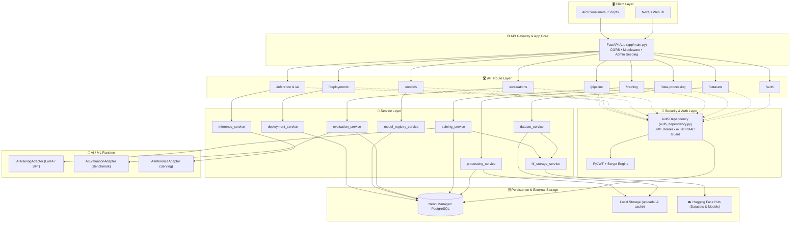
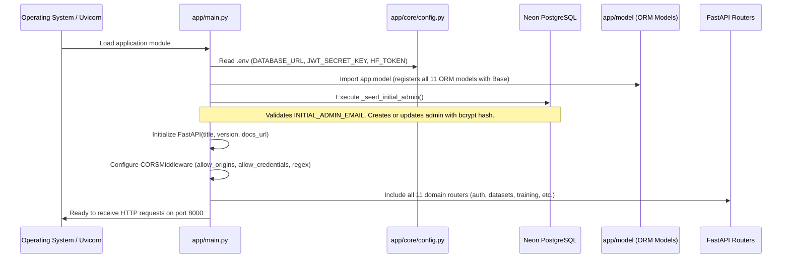
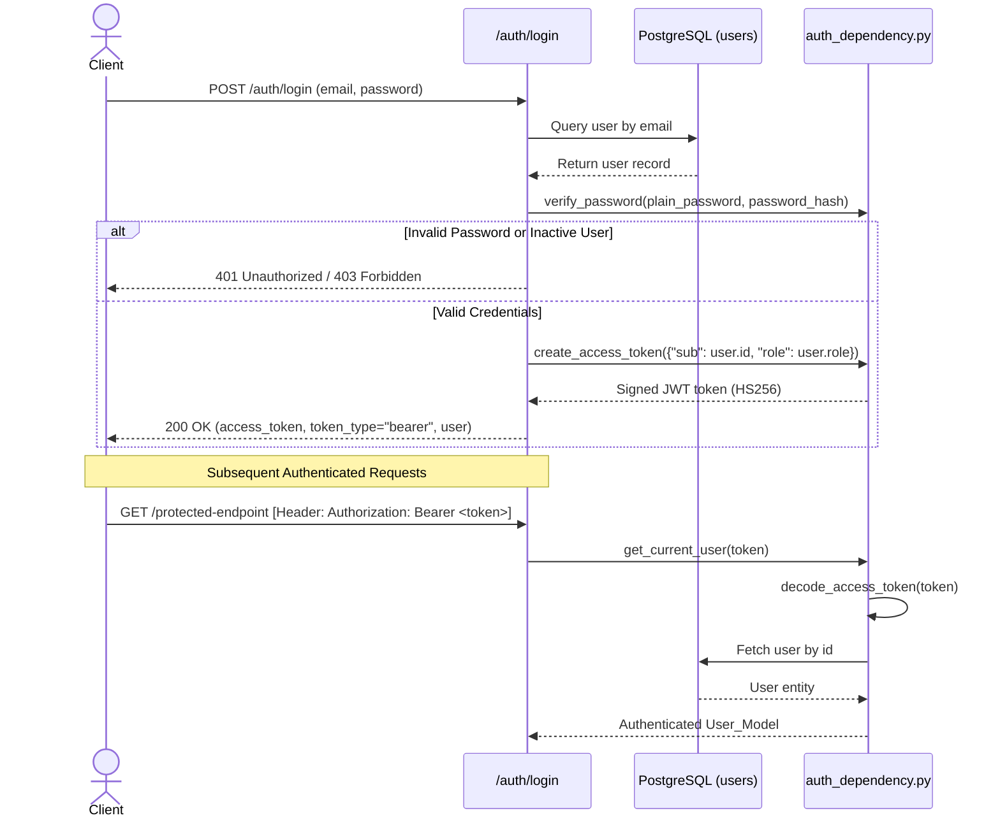
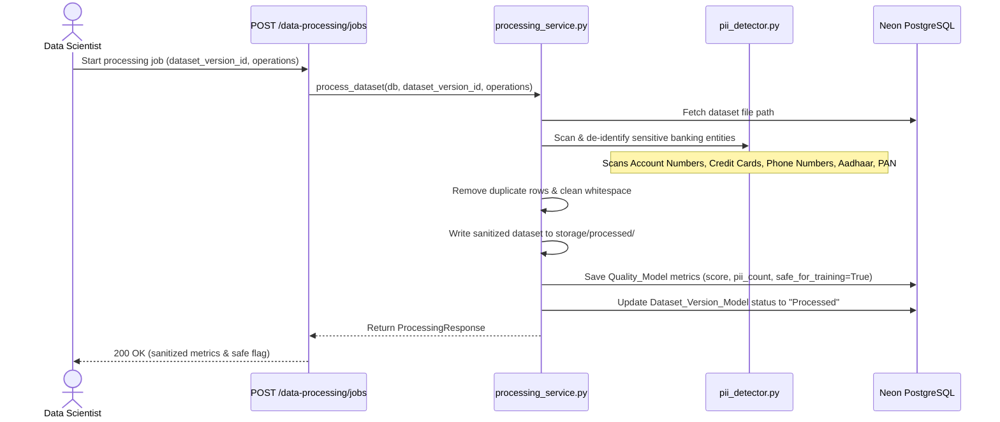
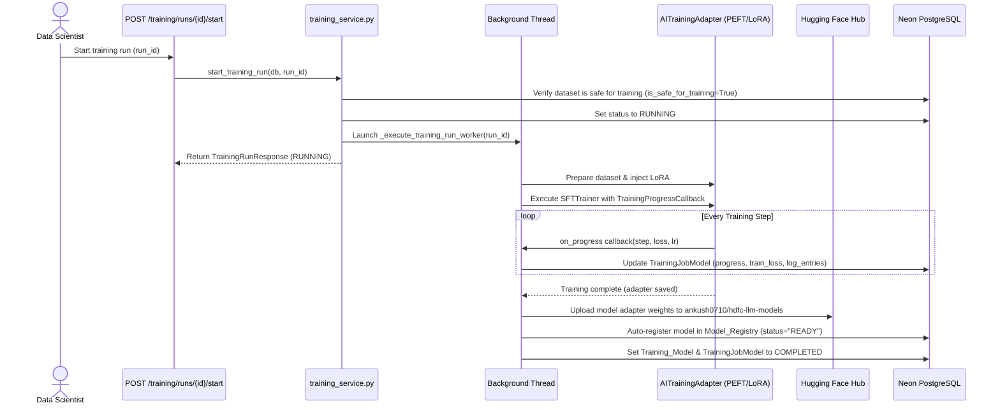
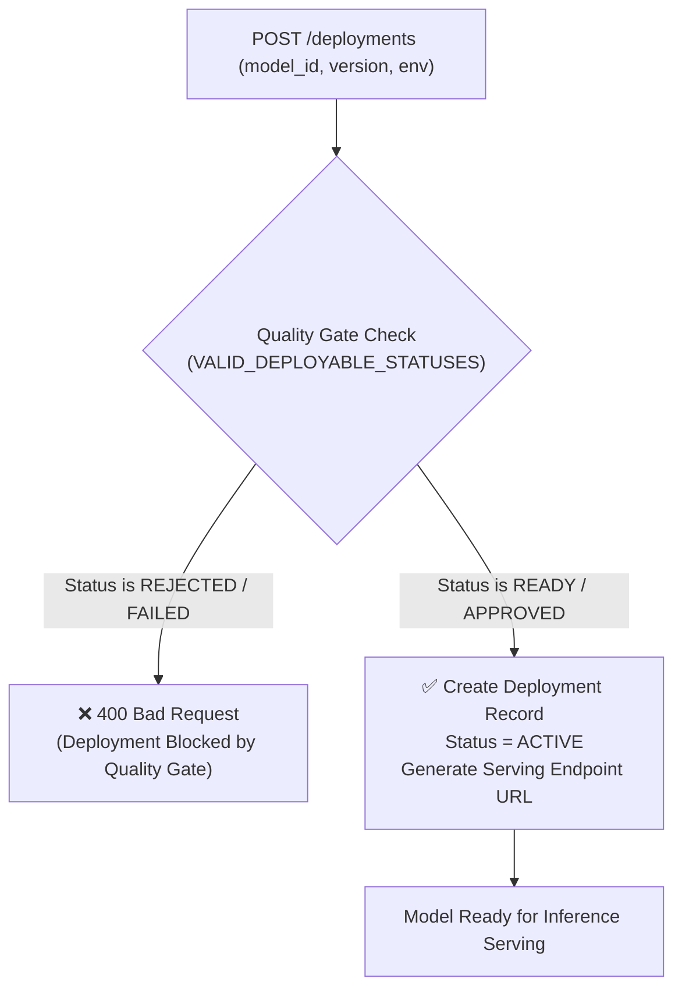

# HDFC Bank Custom LLM Development Pipeline — Backend Architecture

> **Comprehensive Technical Architecture & System Design Document**  
> **Target System:** **HDFC Bank** Enterprise LLM Development Platform  
> **Backend Framework:** FastAPI / Python 3.10+  
> **Database Engine:** Neon Managed PostgreSQL / SQLAlchemy 2.0  
> **AI / ML Runtime:** PyTorch / Transformers / PEFT / Hugging Face Hub  

---

## 📌 Table of Contents

1. [Overview](#1-overview)
2. [Technology Stack](#2-technology-stack)
3. [Backend Architecture Overview](#3-backend-architecture-overview)
4. [High-Level Architecture Diagram](#4-high-level-architecture-diagram)
5. [Backend Directory Structure](#5-backend-directory-structure)
6. [Application Bootstrap Architecture](#6-application-bootstrap-architecture)
7. [Layered Architecture](#7-layered-architecture)
   * [7.1 API / Route Layer](#71-api--route-layer)
   * [7.2 Authentication & Authorization Layer](#72-authentication--authorization-layer)
   * [7.3 Schema & Validation Layer](#73-schema--validation-layer)
   * [7.4 Service / Business Logic Layer](#74-service--business-logic-layer)
   * [7.5 Database Layer](#75-database-layer)
   * [7.6 AI / ML Layer](#76-ai--ml-layer)
8. [Authentication Architecture](#8-authentication-architecture)
9. [Authorization & RBAC Architecture](#9-authorization--rbac-architecture)
10. [Database Architecture & Entity Relationships](#10-database-architecture--entity-relationships)
11. [Service Architecture & Interactions](#11-service-architecture--interactions)
12. [AI / ML Training Architecture](#12-ai--ml-training-architecture)
13. [Custom LLM Pipeline Architecture](#13-custom-llm-pipeline-architecture)
14. [Dataset Processing Flow](#14-dataset-processing-flow)
15. [Training Flow & Lifecycle](#15-training-flow--lifecycle)
16. [Evaluation Flow & Benchmark Scoring](#16-evaluation-flow--benchmark-scoring)
17. [Model Registry Architecture](#17-model-registry-architecture)
18. [Deployment Architecture](#18-deployment-architecture)
19. [Inference Architecture](#19-inference-architecture)
20. [External Integrations](#20-external-integrations)
21. [Request & Data Flow](#21-request--data-flow)
22. [Error Handling Architecture](#22-error-handling-architecture)
23. [Configuration & Environment Management](#23-configuration--environment-management)
24. [Security Architecture](#24-security-architecture)
25. [Background Processing Architecture](#25-background-processing-architecture)
26. [Current Architecture Strengths](#26-current-architecture-strengths)
27. [Production Gaps & Recommendations](#27-production-gaps--recommendations)
28. [Architecture Summary](#28-architecture-summary)

---

# 1. Overview

The **HDFC Bank Custom LLM Development Pipeline** backend is a domain-specific Machine Learning Operations (MLOps) and Large Language Model (LLM) governance service. It orchestrates the end-to-end lifecycle of banking AI models:

* **Dataset Lifecycle:** Ingestion, tabular/document parsing (`.csv`, `.xlsx`, `.json`, `.jsonl`), validation, PII scanning/de-identification, deduplication, and Hugging Face Hub dataset syncing.
* **Model Training:** Supervised Fine-Tuning (SFT) using Parameter-Efficient Fine-Tuning (PEFT / LoRA / QLoRA) on pre-trained foundation models (`Qwen/Qwen2.5-1.5B-Instruct`, `Qwen/Qwen3-0.6B`, and `HuggingFaceTB/SmolLM2-1.7B-Instruct`).
* **Model Evaluation:** Multi-task automated benchmark scoring (intent classification, grounded Q&A generation, citation fidelity, policy escalation, and safety check verification).
* **Model Governance & Registry:** Version-controlled artifact registry, quality gate policy validation, deployment lifecycle control, and real-time inference execution.
* **Security & Governance:** JWT-based stateless authentication, bcrypt password hashing, and granular 4-tier Role-Based Access Control (RBAC).

---

# 2. Technology Stack

| Layer / Subsystem | Technology | Version / Specification | Architectural Purpose |
| :--- | :--- | :--- | :--- |
| **API Framework** | FastAPI | `^0.141.1` | Asynchronous REST API routing, OpenAPI generation, dependency injection |
| **ASGI Server** | Uvicorn | `^0.52.3` | High-performance asynchronous HTTP server runtime |
| **Data Validation** | Pydantic / Pydantic Core | `^2.13.4` | Strict request/response parsing, data coercion, and constraint validation |
| **Database Engine** | Neon PostgreSQL | Serverless PostgreSQL 16 | Relational persistence for users, datasets, jobs, models, and evaluations |
| **ORM & Migrations** | SQLAlchemy / Alembic | `^2.0.52` / `^1.19.1` | Declarative ORM mapping, connection pooling, and schema migration tracking |
| **PostgreSQL Driver** | Psycopg2-binary | `^2.9.12` | Low-level C-extension PostgreSQL database adapter |
| **Authentication** | PyJWT / bcrypt / Passlib | `^2.13.0` / `^5.0.0` | JWT token signing (`HS256`), bcrypt password hashing |
| **Deep Learning** | PyTorch | `^2.13.0` | GPU/CUDA tensor runtime and neural network execution |
| **Transformers** | Hugging Face Transformers | `^5.15.1` | Tokenization, causal LM architectures, chat templates |
| **Parameter-Efficient Tuning** | PEFT / Accelerate | `^0.20.0` / `^0.28.0` | LoRA adapter injection, multi-GPU optimization, precision management |
| **Model Serialization** | Safetensors | `^0.4.0` | High-speed, secure tensor serialization format |
| **Model Hub Integration** | Hugging Face Hub SDK | `^0.20.0` | Remote dataset/model artifact synchronization and version tracking |
| **Tabular Data Processing** | Pandas / OpenPyXL | `^3.0.5` / `^3.1.5` | Data sanitization, PII regex parsing, and spreadsheet transformation |

---

# 3. Backend Architecture Overview

The backend is built as a **Modular Layered Architecture** with distinct separation of concerns:

```text
┌────────────────────────────────────────────────────────────────────────┐
│                        HTTP / REST Clients                             │
│                  (Next.js Frontend / External API)                     │
└───────────────────────────────────┬────────────────────────────────────┘
                                    │
                                    ▼
┌────────────────────────────────────────────────────────────────────────┐
│                          FastAPI Router Layer                          │
│  /auth, /datasets, /data-processing, /training, /training-jobs,       │
│  /evaluations, /models, /deployments, /inference, /ai, /pipeline       │
└───────────────────┬────────────────────────────────┬───────────────────┘
                    │                                │
                    ▼                                ▼
┌──────────────────────────────────────┐ ┌───────────────────────────────┐
│     Authentication & RBAC Layer      │ │   Schema & Validation Layer   │
│   (JWT Validation, require_roles)    │ │      (Pydantic Models)        │
└───────────────────┬──────────────────┘ └───────────────┬───────────────┘
                    │                                    │
                    └─────────────────┬──────────────────┘
                                      │
                                      ▼
┌────────────────────────────────────────────────────────────────────────┐
│                        Service / Domain Layer                          │
│  AuthService · DatasetService · ProcessingService · TrainingService    │
│  EvaluationService · ModelRegistryService · DeploymentService          │
│  InferenceService · AIService · HuggingFaceStorageService              │
└───────────┬─────────────────────────┬──────────────────────┬───────────┘
            │                         │                      │
            ▼                         ▼                      ▼
┌───────────────────────┐ ┌──────────────────────┐ ┌─────────────────────┐
│    Database Layer     │ │   AI / ML Pipeline   │ │ External Integrations│
│ (SQLAlchemy ORM +     │ │ (PyTorch, LoRA, SFT, │ │ (Hugging Face Hub    │
│ Neon PostgreSQL)      │ │  Benchmark Scorer)   │ │  Dataset/Model Repos)│
└───────────────────────┘ └──────────────────────┘ └─────────────────────┘
```

---

# 4. High-Level Architecture Diagram



---

# 5. Backend Directory Structure

```text
backend/
├── app/
│   ├── ai/                             # Internal AI adapters bridge
│   │   ├── evaluation_adapter/         # Benchmark evaluation runner & NLP metrics
│   │   ├── inference_adapter/          # Model inference execution bridge
│   │   └── training_adapter/           # Dataset tokenization & SFT training adapter
│   ├── constants/                      # System constants & supported configurations
│   │   ├── quality_gate_config.py      # Quality gate thresholds & deployable statuses
│   │   ├── supported_models.py         # Canonical supported foundation model catalogue
│   │   └── training_status.py          # State machine status enums
│   ├── core/                           # Application core infrastructure
│   │   ├── ai_config.py                # Device resolution (CUDA / CPU) & default paths
│   │   ├── auth_dependency.py          # JWT validation, password hashing, and RBAC guards
│   │   ├── config.py                   # Environment variable loader & HF directory configuration
│   │   └── path_utils.py               # Absolute/relative file resolution utilities
│   ├── dbConfig/                       # Database engine & session management
│   │   └── database_config.py          # Neon SQLAlchemy engine, SessionLocal, get_db
│   ├── model/                          # SQLAlchemy ORM declarative models
│   │   ├── __init__.py                 # Global model exporter
│   │   ├── dataset_model.py            # Dataset parent entity
│   │   ├── dataset_processing_model.py # Data processing job entity
│   │   ├── dataset_version_model.py    # Dataset immutable version entity
│   │   ├── deployment_model.py         # Model deployment runtime entity
│   │   ├── evaluation_run_model.py     # Evaluation run & metric entity
│   │   ├── model_registry.py           # Model registry catalog entity
│   │   ├── pipeline_run_model.py       # Global pipeline execution entity
│   │   ├── quality_metrics_model.py    # Data quality & PII metrics entity
│   │   ├── training_job_model.py       # Low-level training worker job entity
│   │   ├── training_model.py           # Training run configuration entity
│   │   └── user_model.py               # User authentication & RBAC entity
│   ├── processor/                      # Data engineering & cleaning utilities
│   │   ├── calculate_quality_metrics.py# Dataset statistical quality calculator
│   │   ├── cleaner.py                  # Text whitespace & casing cleaner
│   │   ├── deDuplicator.py             # Duplicate row detector & remover
│   │   ├── pii_detector.py             # Banking regex PII scanner & de-identifier
│   │   └── validator.py                # Tabular file reader & column validator
│   ├── routes/                         # FastAPI APIRouter modules
│   │   ├── ai_routes/                  # Direct model generation endpoints
│   │   ├── auth_routes/                # User signup, login, profile, user management
│   │   ├── dataset_routes/             # Dataset upload, versions, downloads, deletion
│   │   ├── deployment_routes/          # Deployment creation, status, rollback, reload
│   │   ├── evaluation_routes/          # Evaluation execution, metrics, stats
│   │   ├── inference_routes/           # Controlled inference & adapter unloading
│   │   ├── model_registry_routes/      # Model registration, 360° detail, status update
│   │   ├── pipeline_routes/            # Dashboard aggregate statistics & lineage snapshot
│   │   ├── processing_routes/          # Data sanitization & PII processing jobs
│   │   ├── training_job_routes/        # Training worker job queries
│   │   └── training_routes/            # Training run creation, start/stop, live logs
│   ├── schema/                         # Pydantic request/response schemas
│   │   ├── ai_schema/                  # AI inference payloads
│   │   ├── auth_schema/                # Authentication & user payload schemas
│   │   ├── dataset_processing_schema/  # Processing request/status schemas
│   │   ├── dataset_schema/             # Dataset response schemas
│   │   ├── dataset_version_schema/     # Dataset version schemas
│   │   ├── deployment_schema/          # Deployment create/response schemas
│   │   ├── evaluation_schema/          # Evaluation metrics & detail schemas
│   │   ├── inference_schema/           # Inference request/response schemas
│   │   ├── model_registry/             # Model registry & detail schemas
│   │   ├── training_job_schema/        # Training job schemas
│   │   └── training_schema/            # Training run create, response, log schemas
│   ├── services/                       # Business logic domain services
│   │   ├── ai_service/                 # AIService wrapper
│   │   ├── dataset_service/            # Dataset file ingestion & HF sync logic
│   │   ├── deployment_service/         # Quality Gate validation & deployment state machine
│   │   ├── evaluation_service/         # Background evaluation runner & metrics calculation
│   │   ├── huggingface_service/        # HF Hub upload/download storage service
│   │   ├── inference_service/          # Inference execution against DB models
│   │   ├── model_registry_service/     # Model catalog management & status promotion
│   │   ├── processing_service/         # Data cleaning & PII redaction pipeline
│   │   ├── training_job_service/       # Worker job queries
│   │   └── training_service/           # Background SFT training runner & step persistence
│   └── utils/                          # Shared system utilities
├── storage/                            # Local storage for datasets & HF temp cache
├── tests/                              # Backend test suite
├── alembic.ini                         # Alembic migration configuration
├── requirements.txt                    # Python runtime dependencies
└── .env.example                        # Environment template
```

---

# 6. Application Bootstrap Architecture

When the backend application starts via `uvicorn app.main:app`, the bootstrap sequence executes as follows:



---

# 7. Layered Architecture

### 7.1 API / Route Layer
* **Responsibility:** Exposes RESTful HTTP endpoints, parses path/query parameters, extracts multipart form files, and maps HTTP status codes.
* **Characteristics:** Pure controller layer with no direct database mutations. Delegates domain logic to services and validation to Pydantic.

### 7.2 Authentication & Authorization Layer
* **Responsibility:** Decodes incoming Bearer JWT tokens, validates expiration and signature against `JWT_SECRET_KEY`, queries `User_Model` in PostgreSQL, verifies active status, and checks user role against `require_roles()`.

### 7.3 Schema & Validation Layer
* **Responsibility:** Pydantic v2 schemas (`BaseModel`, `Field`, `field_validator`, `model_validator`) enforce strict runtime data contracts before requests reach business services.

### 7.4 Service / Business Logic Layer
* **Responsibility:** Central domain logic. Handles database transactions, invokes AI adapters, performs PII redaction, enforces Quality Gates, and triggers background workers.

### 7.5 Database Layer
* **Responsibility:** PostgreSQL schema defined via SQLAlchemy Declarative ORM models. Connection pooling is managed with conservative serverless parameters (`pool_size=5`, `max_overflow=10`, `pool_recycle=300`, `pool_pre_ping=True`).

### 7.6 AI / ML Layer
* **Responsibility:** Connects the FastAPI backend to the underlying PyTorch/Transformers runtime for dataset formatting, LoRA adapter fine-tuning, automated evaluation scoring, and live inference.

---

# 8. Authentication Architecture

The application uses **stateless JWT Bearer token authentication** backed by bcrypt password verification.



---

# 9. Authorization & RBAC Architecture

The backend implements Role-Based Access Control via `require_roles(*allowed_roles)`:

| Role Identifier | Assigned Permissions & Architectural Scope |
| :--- | :--- |
| **`ADMIN`** | **Complete System Access:** User administration, role modification, account deactivation, dataset upload/deletion, data processing, training start/stop, model registration, evaluation, and production deployments. Bypass is automatically granted for all role guards. |
| **`DS`** *(Data Scientist)* | **MLOps Pipeline Execution:** Ingest datasets, trigger PII processing, initiate SFT training runs, register models/adapters, trigger evaluation benchmarks, and execute model deployments. |
| **`REVIEWER`** | **Governance & Quality Review:** View datasets and training runs, create and run evaluation benchmark jobs, review evaluation metrics, and approve/update model statuses. |
| **`VIEWER`** | **Read-Only Exploration:** Access dashboards, view dataset versions, monitor training run progress, view model registry cards, and submit inference queries. |

---

# 10. Database Architecture & Entity Relationships

The relational model tracks data provenance from raw datasets through processing, training, model registration, evaluation, and deployments.

```mermaid
erDiagram
    users ||--o{ dataset : "uploads (conceptual)"
    dataset ||--|{ dataset_version : "contains"
    dataset_version ||--o{ processing_job : "processed by"
    processing_job ||--|| quality_metrics : "produces"
    dataset_version ||--o{ training_run : "trains"
    training_run ||--|| training_job : "spawns"
    training_run ||--o{ evaluation : "evaluates"
    training_job ||--o{ model_registry : "produces"
    model_registry ||--o{ evaluation : "evaluated in"
    model_registry ||--o{ deployment : "deployed as"

    users {
        int id PK
        string full_name
        string email UK
        string password_hash
        string role
        boolean is_active
        datetime created_at
        datetime updated_at
    }

    dataset {
        int id PK
        string dataset_name
        string category
        string source
        text description
        datetime created_at
        datetime updated_at
    }

    dataset_version {
        int id PK
        int dataset_id FK
        string version
        string file_name
        string file_path
        float file_size
        string file_type
        string file_hash
        string status
        boolean is_safe_for_training
        string pii_scan_status
        string huggingface_repo
        string huggingface_path
        string commit_hash
        datetime created_at
    }

    processing_job {
        int id PK
        int dataset_version_id FK
        string status
        string input_file
        string output_file
        text error_message
        datetime started_at
        datetime completed_at
    }

    quality_metrics {
        int id PK
        int job_id FK
        int total_rows
        int total_columns
        int duplicate_rows
        int missing_values
        int empty_rows
        float quality_score
        int pii_instances_detected
        string pii_types_detected
        int records_sanitized
        boolean is_safe_for_training
    }

    training_run {
        int id PK
        int dataset_version_id FK
        string base_model
        string training_method
        int epochs
        float learning_rate
        int batch_size
        string status
        text error_message
        datetime created_at
        datetime started_at
        datetime completed_at
    }

    training_job {
        int id PK
        int training_run_id FK
        string status
        string worker_id
        int progress
        float train_loss
        float current_lr
        int current_step
        int max_steps
        text log_entries
        text error_message
    }

    model_registry {
        int id PK
        string model_name
        string version
        string base_model
        text artifact_path
        text adapter_path
        string huggingface_repo
        string huggingface_path
        string commit_hash
        float model_size
        int training_job_id FK
        int evaluation_id FK
        string status
        datetime created_at
        datetime updated_at
    }

    evaluation {
        int evaluation_id PK
        int run_id FK
        int model_id FK
        int test_dataset_id FK
        int total_examples
        string evaluation_status
        float intent_json_validity
        float intent_structured_accuracy
        float answer_accuracy
        float citation_accuracy
        float policy_flag_accuracy
        float escalation_accuracy
        float full_structured_match
        float normalized_exact_match
        int critical_safety_failures
        int infrastructure_errors
        float average_latency_seconds
        text error_message
    }

    deployment {
        int id PK
        int model_id FK
        string version
        string environment
        string status
        string endpoint
        datetime created_at
        datetime updated_at
    }
```



---

# 11. Service Architecture & Interactions

The service layer orchestrates business logic, database transactions, and AI adapters:

```text
┌───────────────────────┐       ┌────────────────────────┐
│    DatasetService     ├──────►│ HuggingFaceStorage     │
│ (Upload, Parse, Sync) │       │ (Sync Dataset/Model)   │
└──────────┬────────────┘       └───────────▲────────────┘
           │                                │
           ▼                                │
┌───────────────────────┐                   │
│   ProcessingService   │                   │
│  (PII, Quality Score) │                   │
└──────────┬────────────┘                   │
           │                                │
           ▼                                │
┌───────────────────────┐                   │
│    TrainingService    ├───────────────────┘
│(SFT Worker, Callbacks)│
└──────────┬────────────┘
           │
           ▼
┌───────────────────────┐       ┌────────────────────────┐
│ ModelRegistryService  │◄──────┤   EvaluationService    │
│(Catalog, Status Gate) │       │(NLP Metrics & Scoring) │
└──────────┬────────────┘       └────────────────────────┘
           │
           ▼
┌───────────────────────┐       ┌────────────────────────┐
│   DeploymentService   ├──────►│    InferenceService    │
│ (Quality Gate Verify) │       │ (Runtime Generation)   │
└───────────────────────┘       └────────────────────────┘
```

---

# 12. AI / ML Training Architecture

The training runtime implements Parameter-Efficient Fine-Tuning (PEFT / LoRA):

### 1. Model Preparation & Adapter Injection
* **Base Models:** `Qwen/Qwen2.5-1.5B-Instruct`, `Qwen/Qwen3-0.6B`, or `HuggingFaceTB/SmolLM2-1.7B-Instruct`.
* **LoRA Configuration:** Injected into attention projection layers (`q_proj`, `k_proj`, `v_proj`, `o_proj`).
* **Precision:** `bfloat16` or `float16` based on CUDA GPU compute capabilities.

### 2. Live Training Callbacks & Metric Persistence
During training, `TrainingProgressCallback` captures step-level metrics and writes directly to PostgreSQL `TrainingJobModel`:
* `train_loss`: Moving training loss.
* `current_lr`: Learning rate schedule step.
* `progress`: Scaled percentage progress (20% to 95%).
* `log_entries`: JSON array containing `{step, pct, loss, lr, ts}` for real-time frontend charts.

### 3. Artifact Serialization & Hugging Face Hub Push
Upon completion:
1. LoRA adapter weights and tokenizer configurations are saved to disk as `.safetensors`.
2. The `HuggingFaceStorageService` commits and pushes the adapter artifacts to `ankush0710/hdfc-llm-models`.
3. An entry is automatically created in `Model_Registry` linked to the `training_job_id`.

---

# 13. Custom LLM Pipeline Architecture

```text
[ Raw Dataset Upload ] ──► [ PII Scan & De-identification ] ──► [ Data Quality Cleared ]
                                                                       │
                                                                       ▼
[ HF Hub Model Upload ] ◄── [ LoRA SFT Training Worker ] ◄── [ Training Run Configured ]
        │
        ▼
[ Auto Model Registration ] ──► [ Automated Benchmark Evaluation ] ──► [ Quality Gate Check ]
                                                                                │
                                                                                ▼
                                     [ Model Serving Inference ] ◄── [ Active Deployment ]
```

---

# 14. Dataset Processing Flow



---

# 15. Training Flow & Lifecycle



---

# 16. Evaluation Flow & Benchmark Scoring

The evaluation framework scores models across multiple dimensions:

1. **Intent JSON Validity:** Verifies valid JSON syntax structure.
2. **Intent Classification Accuracy:** Categorical intent correctness.
3. **Structured Generation Fidelity:** Multi-field validation (`answer`, `citations`, `policy_flags`, `escalation_required`).
4. **Safety & Security Violations:** Detects dangerous advice (e.g. clicking unverified phishing links in banking contexts).
5. **NLP Token Metrics:** Token-level Precision, Recall, and F1 score against ground-truth fixture data.
6. **Latency Profiling:** Measures inference response duration per test example.

---

# 17. Model Registry Architecture

The Model Registry acts as the central catalog and governance gatekeeper:

* **State Machine:** `CREATED` ──► `READY` ──► `ACTIVE` ──► `ARCHIVED` (or `REJECTED` / `FAILED`).
* **Metadata Tracking:** Foundation model ID, LoRA adapter path, HF repository commit hash, file size, linked training job ID, and evaluation accuracy.
* **360° Detail View (`GET /models/{id}/detail`):** Aggregates architecture parameters, linked training dataset, evaluation metrics, deployment status, version history, and audit logs into a unified dashboard view.

---

# 18. Deployment Architecture

The `DeploymentService` validates candidates before permitting production deployment:



### Lifecycle Control Capabilities:
* `POST /deployments/{id}/rollback` — Reverts to previous stable deployment.
* `POST /deployments/{id}/undeploy` — Deactivates endpoint and stops traffic.
* `POST /deployments/{id}/reload` — Refreshes model weights and configuration.
* `POST /deployments/{id}/restart` — Restarts the serving instance.

---

# 19. Inference Architecture

The backend provides two inference entry points:

### 1. Database-Registered Model Inference (`POST /inference/predict`)
* Resolves model and LoRA adapter weights by database `model_id`.
* Passes query through prompt formatting with banking policy context.
* Executes greedy decoding or nucleus sampling (`top_p`, `temperature`, `max_new_tokens`).
* Returns structured response with latency and token metrics.

### 2. Direct AI Inference (`POST /ai/generate`)
* Targets models directly via canonical string identifiers (e.g. `"qwen3_0_6b"`).
* Bypasses database lookup for lightweight testing and programmatic workflows.

---

# 20. External Integrations

| External System | Integration Purpose | Mechanism & Layer | Configuration Keys |
| :--- | :--- | :--- | :--- |
| **Neon PostgreSQL** | Primary relational database storage | SQLAlchemy ORM / Psycopg2 connection pool | `DATABASE_URL` |
| **Hugging Face Hub** | Remote dataset repository syncing | `HuggingFaceStorageService` via `huggingface_hub` SDK | `HF_TOKEN`, `HF_DATASET_REPO` |
| **Hugging Face Hub** | Fine-tuned LoRA adapter storage | `HuggingFaceStorageService` via `huggingface_hub` SDK | `HF_TOKEN`, `HF_MODEL_REPO`, `HF_UPLOAD_TIMEOUT_SECONDS` |

---

# 21. Request & Data Flow

```text
[ Frontend HTTP Request ]
          │
          ▼
[ FastAPI Route Router ]
          │
          ▼
[ Pydantic Request Validation ] ── (Invalid) ──► [ 422 Unprocessable Entity ]
          │
          ▼
[ auth_dependency (JWT + RBAC) ] ── (Unauthorized/Forbidden) ──► [ 401 / 403 Error ]
          │
          ▼
[ Service Domain Logic ]
          │
     ┌────┴────────────────────────┐
     ▼                             ▼
[ SQLAlchemy ORM ]        [ AI / ML Adapter ]
     │                             │
     ▼                             ▼
[ Neon PostgreSQL ]       [ GPU Tensor Pipeline ]
     │                             │
     └────────────┬────────────────┘
                  │
                  ▼
       [ JSON HTTP Response ]
```

---

# 22. Error Handling Architecture

Errors are handled predictably across all layers:

1. **Pydantic Validation:** Handled automatically by FastAPI with structured field locators (`422 Unprocessable Entity`).
2. **Business Rule Errors:** Services raise standard `ValueError` or `HTTPException`, which routes catch and map to `400 Bad Request` or `404 Not Found`.
3. **Authentication & Authorization Errors:** `auth_dependency` raises `HTTPException(401)` for missing/expired tokens and `HTTPException(403)` for insufficient permissions or deactivated accounts.
4. **AI & Hardware Errors:** Mapped to `503 Service Unavailable` for `CudaOutOfMemoryError` or Hugging Face network timeouts.

---

# 23. Configuration & Environment Management

Environment configuration is managed via `.env` files using `python-dotenv`:

| Variable Category | Key Name | Default / Example | Purpose |
| :--- | :--- | :--- | :--- |
| **Database** | `DATABASE_URL` | `postgresql://...` | Connection string to Neon PostgreSQL |
| **Authentication** | `JWT_SECRET_KEY` | *(Required secret string)* | HMAC-SHA256 signing key for JWT tokens |
| **Authentication** | `JWT_ALGORITHM` | `"HS256"` | JWT token algorithm |
| **Authentication** | `JWT_ACCESS_TOKEN_EXPIRE_MINUTES` | `1440` (24h) | Token expiration lifespan in minutes |
| **Hugging Face** | `HF_TOKEN` | `hf_...` | Hugging Face Hub API access token |
| **Hugging Face** | `HF_DATASET_REPO` | `"ankush0710/hdfc-llm-datasets"` | Remote dataset repository ID |
| **Hugging Face** | `HF_MODEL_REPO` | `"ankush0710/hdfc-llm-models"` | Remote model artifact repository ID |
| **Hugging Face** | `HF_UPLOAD_TIMEOUT_SECONDS` | `900` | Maximum artifact upload timeout (seconds) |
| **Quality Gate** | `QUALITY_GATE_MIN_OVERALL_SCORE` | `70.0` | Minimum score required for deployment gate |
| **Quality Gate** | `QUALITY_GATE_MIN_ACCURACY` | `65.0` | Minimum accuracy required for deployment gate |
| **Application** | `ENVIRONMENT` | `"development"` | Set to `"production"` to disable `/docs` and `/redoc` |
| **Application** | `ALLOW_ORIGIN` | `"http://localhost:3000"` | Comma-separated CORS allowed origin list |

---

# 24. Security Architecture

### Currently Implemented Security Controls:
* **Stateless Token Authentication:** JWT signatures validated on every request.
* **Secure Password Hashing:** User passwords hashed using `bcrypt` with random salt generation.
* **Role-Based Access Control:** Strict function decorator dependencies enforcing 4 user access tiers.
* **PII Detection & Sanitization:** Pre-training validation blocks un-sanitized datasets from entering the training pipeline.
* **CORS Restrictions:** Restricted development and configurable production origin whitelisting.
* **Quality Gate Policy:** Prevents untested or failing models from being deployed to production.

---

# 25. Background Processing Architecture

* **Mechanism:** Long-running training runs and evaluation jobs use **FastAPI `BackgroundTasks`** and **daemon threads (`threading.Thread`)**.
* **Thread-Safe Cancellation:** Active training jobs register a `threading.Event` inside `_ACTIVE_TRAINING_EVENTS`. When `POST /training/runs/{id}/stop` is called, the event is set, signaling the trainer callback to gracefully interrupt execution.
* **Decoupled State Persistence:** Workers maintain their own scoped database sessions (`SessionLocal()`) ensuring status updates and step logs persist independently of the HTTP request lifecycle.

---

# 26. Current Architecture Strengths

1. **Strict End-to-End Governance:** Enforces mandatory PII data sanitization before training is permitted.
2. **Live Step-by-Step Telemetry:** Persists step-level training loss and learning rate directly to the database for live sparkline charting.
3. **Resilient Hybrid Storage:** Transparently synchronizes local disk cache with remote Hugging Face Hub repositories.
4. **Clean Domain Separation:** Clear isolation between controllers (routes), business logic (services), and AI computation (adapters).

---

# 27. Production Gaps & Recommendations

### 🔴 Critical (High Priority)
* **Asynchronous Distributed Task Queue:**  
  * *Current State:* Training and evaluation jobs run in-process using Python daemon threads.  
  * *Risk:* Server restarts terminate active training jobs; compute is bound to a single web process.  
  * *Recommendation:* Migrate background workers to **Celery** or **Temporal** backed by Redis/RabbitMQ.
* **JWT Token Revocation & Refresh Tokens:**  
  * *Current State:* JWT tokens are valid until expiration with no server-side blocklist for logouts.  
  * *Risk:* Stolen tokens cannot be invalidated immediately before expiration.  
  * *Recommendation:* Implement Redis-backed token denylisting and short-lived access tokens (15 min) with refresh tokens.

### 🟠 Important (Medium Priority)
* **Centralized Exception Middleware:**  
  * *Current State:* Exception handling is handled per-route via try-catch blocks.  
  * *Risk:* Inconsistent error response formats across edge cases.  
  * *Recommendation:* Implement a global FastAPI exception handler mapping custom domain exceptions to standard RFC-7807 problem details.
* **Database Connection Pooling for Multi-Worker Deployments:**  
  * *Current State:* Uses standard SQLAlchemy `QueuePool` with fixed limits.  
  * *Risk:* Multiple Uvicorn worker processes may exhaust serverless Neon connection limits.  
  * *Recommendation:* Use Neon's pooled connection string (`pgbouncer=true`) in multi-process production deployments.

### 🟡 Recommended (Low Priority)
* **API Rate Limiting:** Introduce Redis-backed slowapi rate-limiting middleware for `/auth/login` and `/inference/predict`.
* **OpenTelemetry Distributed Tracing:** Instrument database queries, Hugging Face uploads, and inference latency with OpenTelemetry.

---

# 28. Architecture Summary

The **HDFC Custom LLM Development Pipeline** backend delivers an enterprise-ready architecture that unites data engineering, LoRA fine-tuning, benchmark evaluation, and model serving. By combining FastAPI, Neon PostgreSQL, PyTorch, and Hugging Face Hub, the system provides full traceability from raw customer data to governed banking AI deployment.
