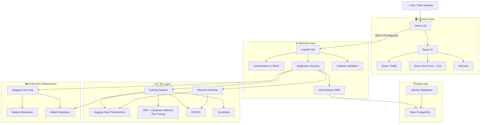
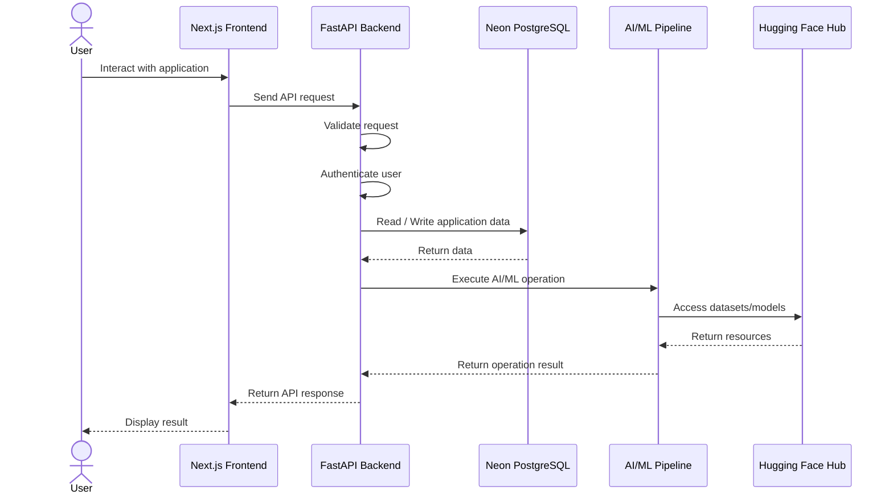
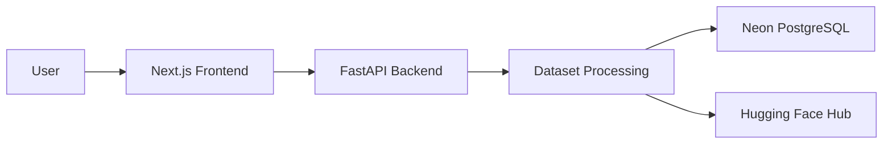
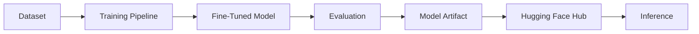
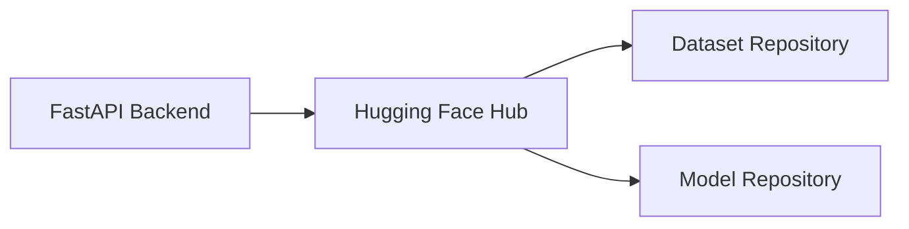
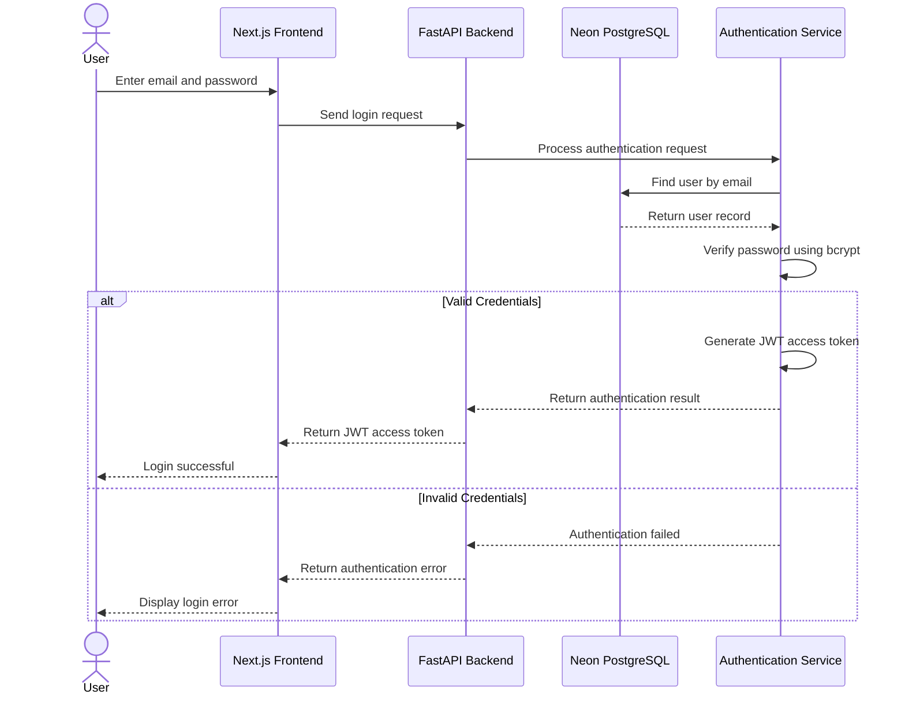
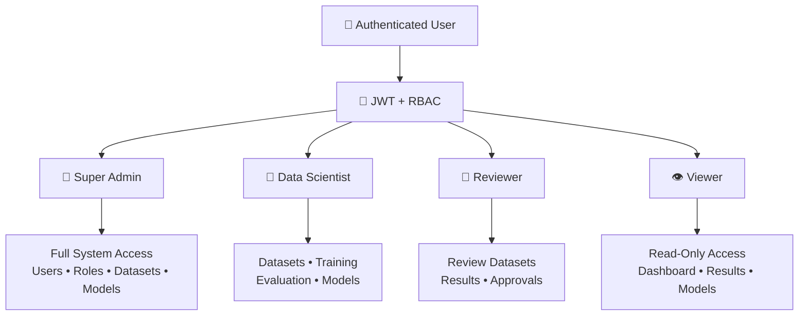
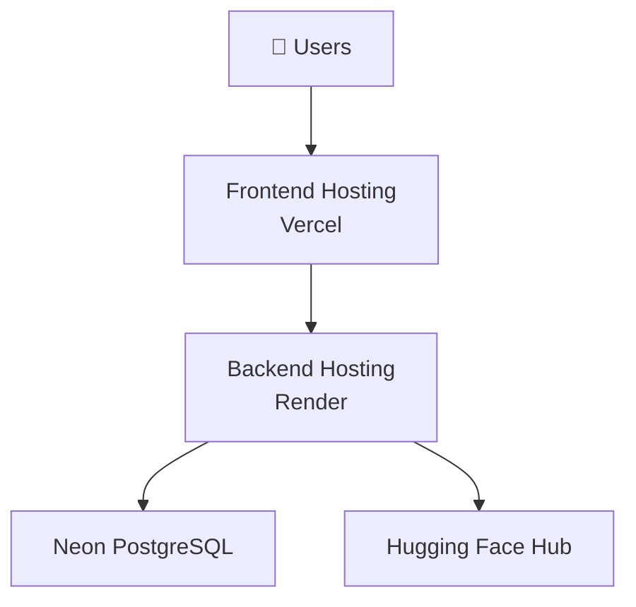

# HDFC Bank Custom LLM Development Pipeline

> A governed end-to-end platform for managing the lifecycle of domain-specific Large Language Models (LLMs), including dataset management, model training, fine-tuning, evaluation, model artifact management, and controlled inference for banking use cases.

---

## 📌 Table of Contents

* [Project Overview](#-project-overview)
* [Key Capabilities](#-key-capabilities)
* [System Architecture](#-system-architecture)
* [Technology Stack](#-technology-stack)
* [Repository Structure](#-repository-structure)
* [Application Architecture](#-application-architecture)
* [Data and Model Flow](#-data-and-model-flow)
* [Prerequisites](#-prerequisites)
* [Environment Configuration](#-environment-configuration)
* [Local Development Setup](#-local-development-setup)
* [Running the Application](#-running-the-application)
* [Database](#-database)
* [Hugging Face Integration](#-hugging-face-integration)
* [Authentication and Authorization](#-authentication-and-authorization)
* [AI/ML Runtime](#-aiml-runtime)
* [API Documentation](#-api-documentation)
* [Development Commands](#-development-commands)
* [Deployment Architecture](#-deployment-architecture)
* [Security Guidelines](#-security-guidelines)
* [Troubleshooting](#-troubleshooting)
* [Team Development Workflow](#-team-development-workflow)
* [Future Improvements](#-future-improvements)
* [License](#-license)

---

# 📖 Project Overview

The **HDFC Bank Custom LLM Development Pipeline** is a full-stack AI/ML platform designed to support the development and management of domain-specific Large Language Models for banking-related use cases.

The platform brings together the major stages of the LLM lifecycle into a centralized application:

* Dataset ingestion and management
* Dataset processing
* AI/ML training infrastructure
* Fine-tuning using modern transformer technologies
* Training artifact management
* Model storage and distribution
* Model evaluation infrastructure
* Controlled inference
* Authentication and role-based access control
* Database-backed application management

The system consists of three primary layers:

1. **Frontend** — A Next.js-based user interface.
2. **Backend** — A FastAPI application providing APIs, authentication, database access, and AI/ML orchestration.
3. **AI/ML Layer** — PyTorch, Transformers, PEFT, Accelerate, and Hugging Face-based model training and inference infrastructure.

---

# 🚀 Key Capabilities

## 🖥️ Full-Stack Web Application

The platform provides a modern web interface built with Next.js and React for interacting with the Custom LLM development workflow.

---

## 📊 Dataset Management

The system is designed to support dataset-related workflows, including:

* Dataset ingestion
* Dataset processing
* Spreadsheet-based data handling
* Dataset metadata management
* Integration with external dataset repositories

Dataset processing capabilities are supported through:

* Pandas
* OpenPyXL

---

## 🧠 AI/ML Training Infrastructure

The AI/ML layer supports modern transformer-based workflows using:

* PyTorch
* Hugging Face Transformers
* PEFT
* Accelerate
* Safetensors

The infrastructure is designed to support efficient parameter-efficient fine-tuning workflows.

---

## 🤗 Hugging Face Integration

The application integrates with Hugging Face Hub for external AI/ML resource management.

Environment configuration supports:

* Dataset repositories
* Model repositories
* Hugging Face authentication
* Model artifact uploads

---

## 🗄️ Cloud Database Integration

The application uses **Neon PostgreSQL** as its database platform.

Database functionality is supported through:

* PostgreSQL
* SQLAlchemy
* Psycopg2
* Alembic

---

## 🔐 Authentication and RBAC

The backend includes authentication and authorization dependencies supporting:

* Password hashing
* JWT-based authentication
* Email validation
* Role-based access control

Technologies include:

* PyJWT
* bcrypt
* Passlib
* email-validator

---

# 🏗️ System Architecture



---

# 🔄 High-Level Application Flow



---

# 🛠️ Technology Stack

## Frontend

| Technology      | Purpose            |
| --------------- | ------------------ |
| Next.js 16.3.0  | User interface     |
| Tailwind CSS 4  | Styling            |
| Redux Toolkit   | State management   |
| React Redux     | Redux integration  |
| Axios           | API communication  |
| React Hook Form | Form management    |
| Zod             | Data validation    |
| Recharts        | Data visualization |
| Lucide React    | Icons              |
| Sonner          | Notifications      |

---

## Backend

| Technology       | Purpose                   |
| ---------------- | ------------------------- |
| FastAPI          | Backend API framework     |
| Uvicorn          | ASGI server               |
| Pydantic         | Data validation           |
| SQLAlchemy       | ORM                       |
| Alembic          | Database migrations       |
| Psycopg2         | PostgreSQL driver         |
| Python Dotenv    | Environment configuration |
| Python Multipart | File upload handling      |

---

## Database

| Technology | Purpose                     |
| ---------- | --------------------------- |
| Neon       | Managed PostgreSQL platform |
| SQLAlchemy | Database ORM                |
| Alembic    | Schema migrations           |

---

## Authentication & Security

| Technology      | Purpose                     |
| --------------- | --------------------------- |
| PyJWT           | JWT authentication          |
| bcrypt          | Password hashing            |
| Passlib         | Password security utilities |
| email-validator | Email validation            |

---

## AI / Machine Learning

| Technology       | Purpose                         |
| ---------------- | ------------------------------- |
| PyTorch          | Deep learning framework         |
| Transformers     | Transformer model framework     |
| PEFT             | Parameter-efficient fine-tuning |
| Accelerate       | Training acceleration           |
| Safetensors      | Secure model serialization      |
| Hugging Face Hub | Dataset and model management    |
| PyYAML           | Configuration management        |

---

# 📁 Repository Structure

The repository follows a multi-layer architecture separating frontend, backend, AI/ML, data, schemas, manifests, and documentation.

```text
hdfc-custom-llm-dev-pipeline/
│
├── ai/                         # AI/ML pipeline and runtime
│   ├── artifacts/              # Generated model/training artifacts
│   ├── config/                 # AI/ML configuration
│   ├── evaluation/             # Model evaluation logic
│   ├── inference/              # Model inference functionality
│   ├── models/                 # Model-related logic
│   ├── model_selection/        # Model selection utilities
│   ├── tests/                  # AI/ML tests
│   ├── training/               # Training pipeline
│   └── utils/                  # AI/ML utilities
│
├── backend/                    # FastAPI backend application
│   ├── app/                    # Application source code
│   ├── tests/                  # all tests
│   ├── requirements.txt        # Python dependencies
│   └── .env.example            # Environment variable template
│
├── frontend/                   # Next.js frontend application
│   ├── app/                    # Next.js application
│   ├── public/                 # Static assets
│   ├── package.json            # Node.js dependencies
│   └── .env.production         # Production environment configuration
│
├── data/                       # Project data resources
│
├── docs/                       # Project documentation
│   ├── api/                    # API-related documentation
│   ├── architecture/           # Architecture-related documentation
|   ├── backend/                # All backend-related documentation
│   ├── data-engineering/       # Data engineering-related documentation
│   ├── frontend/               # All frontend-related documentation
│   └── requirements/           # Requirements-related documentation
│
├── manifests/                  # Project manifests
│
├── .gitignore
├── README.md
└── hdfc.py
```
---

# 🧩 Application Architecture

## Frontend Layer

The frontend is responsible for:

* User interaction
* Application pages and UI
* Form handling
* Client-side validation
* API communication
* State management
* Data visualization
* User notifications

### Frontend Technology Flow

```text
User
  │
  ▼
Next.js Application
  │
  ├── React Components
  ├── Redux State Management
  ├── React Hook Form
  ├── Zod Validation
  ├── Axios API Client
  ├── Recharts Visualization
  └── Sonner Notifications
```

---

## Backend Layer

The FastAPI backend acts as the central application layer.

It is responsible for:

* API request handling
* Request validation
* Authentication
* Authorization
* Database interaction
* File upload handling
* AI/ML service integration
* Hugging Face integration

```text
Frontend Request
       │
       ▼
   FastAPI Router
       │
       ▼
Request Validation
       │
       ▼
Authentication / Authorization
       │
       ▼
Application Services
       │
       ├──────────────► Neon PostgreSQL
       │
       ├──────────────► AI/ML Pipeline
       │
       └──────────────► Hugging Face Hub
```

---

# 🔄 Data and Model Flow

## Dataset Flow



Dataset processing is supported by:

* Pandas
* OpenPyXL
* FastAPI file upload handling

---

## Model Lifecycle



---

# 📋 Prerequisites

Before running the project locally, install the following:

### Required

* Git
* Node.js
* npm
* Python
* PostgreSQL-compatible database access through Neon

### Recommended Versions

```text
Node.js: 18+ recommended
Python: 3.10+ recommended
```

You will also need access to:

* Neon PostgreSQL
* Hugging Face Hub

---

# 🔐 Environment Configuration

## Backend Environment Variables

Create a `.env` file inside the `backend` directory based on `.env.example`.

```env
# Neon PostgreSQL Connection URL
DATABASE_URL=

# Hugging Face Hub Credentials & Repositories
HF_TOKEN=
HF_DATASET_REPO=
HF_MODEL_REPO=

# Maximum time a model artifact upload may wait before the run is marked FAILED
HF_UPLOAD_TIMEOUT_SECONDS=

# Application Configuration
ALLOW_ORIGIN=

# Set to 'development' to enable /docs and /redoc endpoints
ENVIRONMENT=development

# Debug configuration
DEBUG=
```

### Environment Variable Description

| Variable                    | Description                       |
| --------------------------- | --------------------------------- |
| `DATABASE_URL`              | Neon PostgreSQL connection string |
| `HF_TOKEN`                  | Hugging Face authentication token |
| `HF_DATASET_REPO`           | Hugging Face dataset repository   |
| `HF_MODEL_REPO`             | Hugging Face model repository     |
| `HF_UPLOAD_TIMEOUT_SECONDS` | Maximum model upload timeout      |
| `ALLOW_ORIGIN`              | Allowed frontend origins for CORS |
| `ENVIRONMENT`               | Application environment           |
| `DEBUG`                     | Debug configuration               |

---

## Frontend Environment Variables

The frontend production configuration includes:

```env
NEXT_PUBLIC_API_URL=
```

### Variable Description

| Variable              | Description                     |
| --------------------- | ------------------------------- |
| `NEXT_PUBLIC_API_URL` | Base URL of the FastAPI backend |

For local development, this should point to your locally running backend.

Example:

```env
NEXT_PUBLIC_API_URL=http://localhost:8000
```

---

# 💻 Local Development Setup

## 1. Clone the Repository

```bash
git clone https://github.com/ankush0710/hdfc-custom-llm-dev-pipeline.git
```

Navigate to the project:

```bash
cd hdfc-custom-llm-dev-pipeline
```

---

# 🖥️ Frontend Setup

Navigate to the frontend directory:

```bash
cd frontend
```

Install dependencies:

```bash
npm install
```

Configure the frontend API URL.

Example:

```env
NEXT_PUBLIC_API_URL=http://localhost:8000
```

Start the development server:

```bash
npm run dev
```

The frontend development server is typically available at:

```text
http://localhost:3000
```

---

# ⚙️ Backend Setup

Navigate to the backend directory:

```bash
cd backend
```

## Create a Virtual Environment

### Windows

```bash
python -m venv venv
```

Activate the environment:

```bash
venv\Scripts\activate
```

### macOS / Linux

```bash
python3 -m venv venv
```

Activate the environment:

```bash
source venv/bin/activate
```

---

## Install Dependencies

```bash
pip install -r requirements.txt
```

---

## Configure Environment Variables

Create your local `.env` file:

```text
backend/.env
```

Add your Neon and Hugging Face configuration.

⚠️ Never commit your `.env` file, Hugging Face token, database credentials, or other secrets to GitHub.

---

# ▶️ Running the Application

The frontend and backend should run in separate terminals.

## Terminal 1 — Backend

From the backend directory, start the FastAPI application using the project's configured Uvicorn entry point.

Example format:

```bash
uvicorn <your_application_module>:app --reload
```

> Use the exact application module configured in your backend project.

---

## Terminal 2 — Frontend

```bash
cd frontend
npm run dev
```

Open:

```text
http://localhost:3000
```

---

# 🗄️ Database

The project uses **Neon PostgreSQL** as its database platform.

The backend interacts with the database using:

```text
FastAPI
   │
   ▼
SQLAlchemy
   │
   ▼
Psycopg2
   │
   ▼
Neon PostgreSQL
```

---

## Database Migrations

The project includes:

```text
Alembic
```

Alembic should be used to manage database schema changes rather than manually modifying production tables.

Recommended workflow:

```text
Model Changes
      │
      ▼
Create Migration
      │
      ▼
Review Migration
      │
      ▼
Apply Migration
      │
      ▼
Neon PostgreSQL
```

---

# 🤗 Hugging Face Integration

The project integrates with Hugging Face Hub for AI/ML resource management.

The backend environment supports:

```env
HF_TOKEN
HF_DATASET_REPO
HF_MODEL_REPO
```

The Hugging Face integration is intended to support:

* Dataset repository access
* Model repository access
* Model artifact uploads



---

# 🔐 Authentication and Authorization

The application uses JWT-based authentication to secure API access. User passwords are securely hashed using bcrypt/Passlib, and authenticated users receive an access token that is used to access protected resources.

## Authentication Request Flow



## Authentication Architecture

The authentication process follows these steps:

1. The user enters their credentials in the Next.js frontend.
2. The frontend sends the login request to the FastAPI backend.
3. The backend validates the authentication request.
4. The system searches for the user in Neon PostgreSQL.
5. The submitted password is verified against the securely hashed password.
6. If authentication is successful, a JWT access token is generated.
7. The access token is returned to the frontend.
8. The authenticated user can use the token to access protected API endpoints.

### Authentication Technologies

* **FastAPI** — Authentication API
* **Neon PostgreSQL** — User data storage
* **SQLAlchemy** — Database interaction
* **bcrypt / Passlib** — Password hashing and verification
* **PyJWT** — JWT access token generation and validation
* **Next.js** — Authentication user interface

Authorization can be implemented through role-based access control to restrict access to protected resources and operations.

## 🛡️ Role-Based Access Control (RBAC)

The platform uses RBAC to control access based on four user roles.



| Role                  | Access                                     |
| --------------------- | ------------------------------------------ |
| 👑 **Super Admin**    | Full system access and user management     |
| 🧠 **Data Scientist** | Datasets, training, evaluation, and models |
| 🔎 **Reviewer**       | Review datasets, results, and approvals    |
| 👁️ **Viewer**        | Read-only access to authorized information |


---

# 🧠 AI/ML Runtime

The AI/ML runtime includes:

```text
PyTorch
    │
    ▼
Hugging Face Transformers
    │
    ▼
PEFT
    │
    ▼
Accelerate
    │
    ▼
Model Training / Fine-Tuning
```

## Core Libraries

### PyTorch

Used as the deep learning runtime.

### Transformers

Used for transformer-based language model operations.

### PEFT

Supports parameter-efficient fine-tuning approaches.

### Accelerate

Provides utilities for efficient training workflows.

### Safetensors

Supports secure and efficient model artifact serialization.

---

# 📊 API Documentation

FastAPI can provide interactive API documentation.

When the application environment is configured for development:

```env
ENVIRONMENT=development
```

API documentation can be accessed through:

### Swagger UI

```text
http://localhost:8000/docs
```

### ReDoc

```text
http://localhost:8000/redoc
```

> API documentation availability depends on the application's environment configuration.

---

# 🧪 Development Commands

## Frontend

### Start Development Server

```bash
npm run dev
```

### Create Production Build

```bash
npm run build
```

### Start Production Server

```bash
npm run start
```

### Run Linting

```bash
npm run lint
```

---

## Backend

Install dependencies:

```bash
pip install -r requirements.txt
```

Start the backend using the project's configured Uvicorn application entry point.

---

# 🌐 Deployment Architecture

The application is **Deployed**.

The production architecture can follow this structure:



## Planned Deployment Components

| Component | Platform         |
| --------- | ---------------- |
| Frontend  | Vercel           |
| Backend   | Render           |
| Database  | Neon PostgreSQL  |
| AI Models | Hugging Face Hub |
| Datasets  | Hugging Face Hub |

> Deployment configuration should be finalized and updated in this README once production URLs are available.

---

# 🔒 Security Guidelines

The following sensitive information must never be committed to GitHub:

❌ Database passwords
❌ Neon connection credentials
❌ Hugging Face tokens
❌ JWT secrets
❌ Production environment files
❌ API keys

Always use environment variables:

```text
.env
.env.local
.env.production
```

Only commit safe templates such as:

```text
.env.example
```

---

# 🛠️ Troubleshooting

## Frontend Cannot Connect to Backend

Check:

* Is the FastAPI backend running?
* Is `NEXT_PUBLIC_API_URL` configured correctly?
* Is the backend port correct?
* Is CORS configured correctly through `ALLOW_ORIGIN`?

---

## Database Connection Error

Check:

* `DATABASE_URL`
* Neon database status
* PostgreSQL connection string format
* Network connectivity

---

## Hugging Face Authentication Error

Check:

* `HF_TOKEN`
* Token permissions
* Repository access
* Dataset repository name
* Model repository name

---

## Backend Dependency Error

Activate your virtual environment and reinstall dependencies:

```bash
pip install -r requirements.txt
```

---

## Frontend Build Error

Remove installed dependencies and reinstall:

```bash
rm -rf node_modules
npm install
```

On Windows, remove the `node_modules` folder manually or using PowerShell.

---

# 🌿 Team Development Workflow

A recommended workflow for contributors:

```text
main
 │
 ├── feature/frontend-feature
 │
 ├── feature/backend-feature
 │
 ├── feature/ai-training
 │
 └── feature/evaluation
```

## Recommended Process

1. Pull the latest changes.
2. Create or switch to your feature branch.
3. Implement your changes.
4. Run the application locally.
5. Test your changes.
6. Commit changes with a meaningful message.
7. Push your branch.
8. Create a Pull Request.
9. Review and merge changes.

Example:

```bash
git checkout main
git pull origin main

git checkout -b feature/your-feature-name

git add .
git commit -m "feat: add your feature"

git push origin feature/your-feature-name
```

---

# 🔮 Future Improvements

Potential future enhancements include:

* Advanced automated model evaluation
* Model comparison dashboards
* Training experiment tracking
* Redis Caching, Load Balancing
* Improved monitoring and observability
* Production-grade model serving
* Background job processing for long-running training tasks
* Advanced dataset validation
* Model version management
* CI/CD automation
* Automated testing pipelines
* Production monitoring
* Enhanced audit logging

---

# 📚 Documentation

Additional project documentation is organized under:

```text
docs/
├── api/
├── architecture/
├── backend/
├── data-engineering/
├── frontend/
└── requirements/
```

This structure is intended to keep detailed technical documentation separate from the primary project README.

---

# 🤝 Contributing

Contributions should follow the project's development workflow.

Before submitting changes:

* Ensure the application runs locally.
* Test affected functionality.
* Do not commit secrets.
* Keep commits focused.
* Use meaningful commit messages.
* Update documentation when necessary.

---

# 📄 License

This project is currently intended for development, educational, and project demonstration purposes.

License terms can be updated based on future project or organizational requirements.

---

# 👨‍💻 Project Team

This project is developed collaboratively by a multidisciplinary team working across:

* Frontend Development
* Backend Development
* AI/ML Engineering
* Data Science
* Model Training
* Integration

Team member details and responsibilities can be added here as the final project team structure is confirmed.

---

# 📌 Project Status

**Currently In Production**

Current infrastructure includes:

* Next.js frontend
* FastAPI backend
* Neon PostgreSQL integration
* SQLAlchemy ORM
* Alembic migrations
* Authentication and RBAC dependencies
* Hugging Face integration
* PyTorch and Transformers runtime
* PEFT-based AI/ML infrastructure

### Deployment Status

| Service                  | Status                     |
| ------------------------ | -------------------------- |
| Frontend                 |  deployed                  |
| Backend                  |  deployed                  |
| Database                 | Neon PostgreSQL            |
| Hugging Face Integration | Configured for project use |

---

## ⭐ Repository

For more information and source code:

**HDFC Bank Custom LLM Development Pipeline**

`https://github.com/ankush0710/hdfc-custom-llm-dev-pipeline`

---