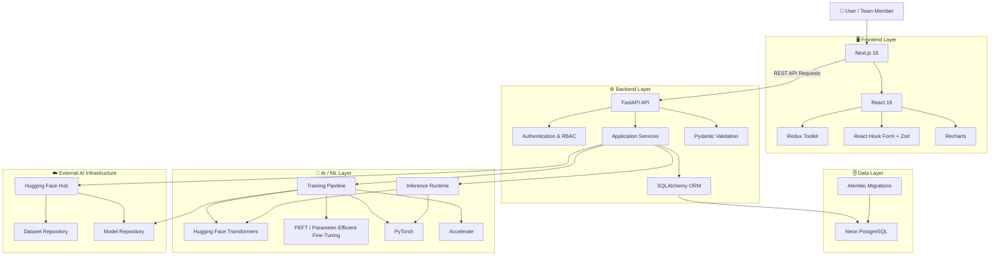
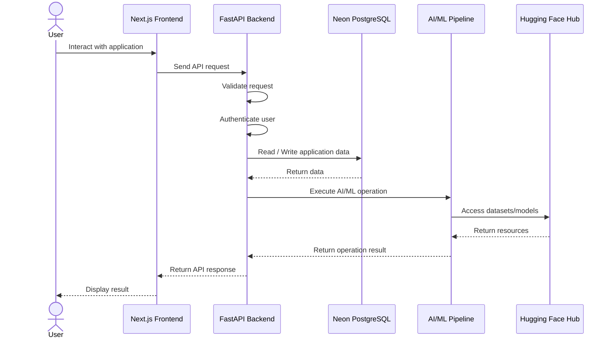
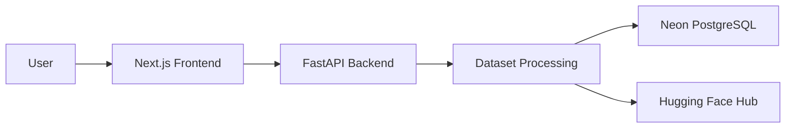
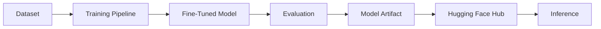
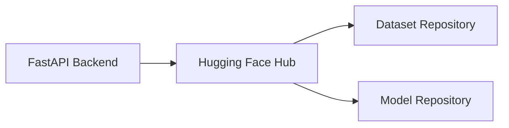
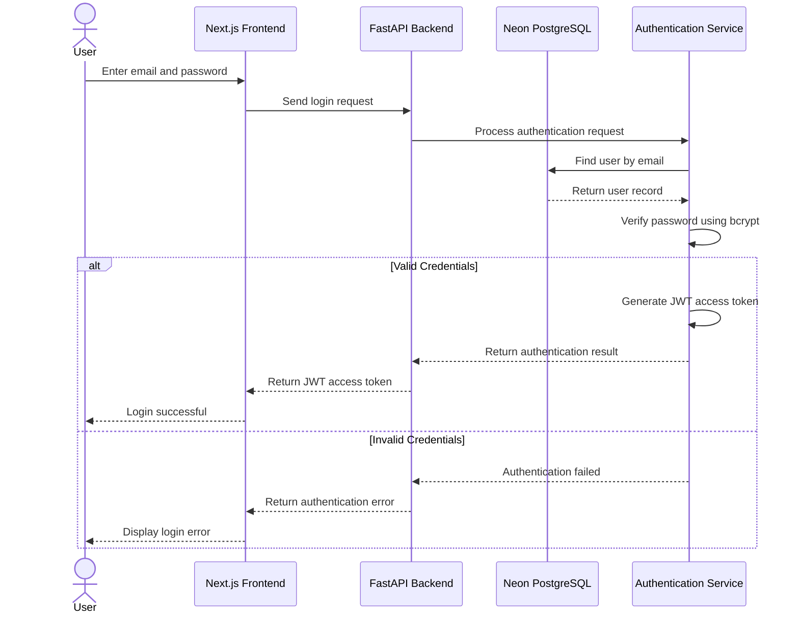
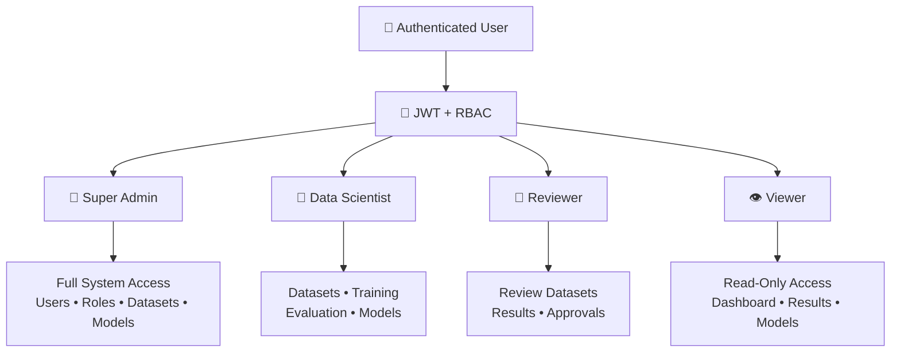
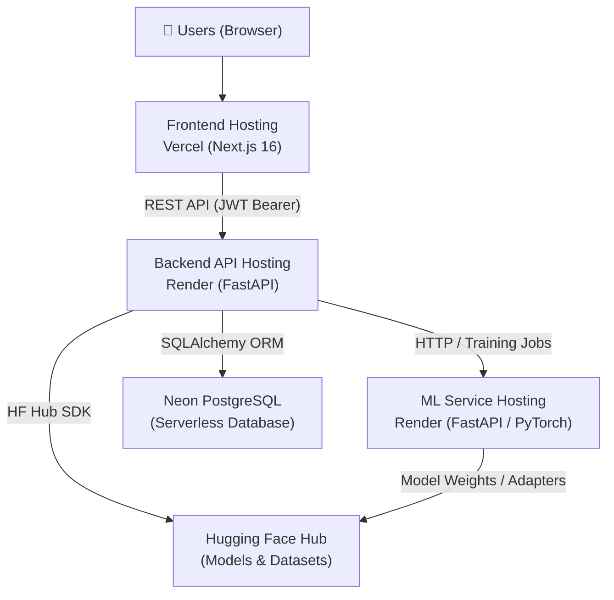

# HDFC Bank Custom LLM Development Pipeline

> A governed end-to-end platform for managing the lifecycle of domain-specific Large Language Models (LLMs), including dataset management, model training, fine-tuning, evaluation, model artifact management, and controlled inference for banking use cases.

---

## 📌 Table of Contents

* [Project Overview](#-project-overview)
* [Key Capabilities](#-key-capabilities)
* [System Architecture](#-system-architecture)
* [High-Level Application Flow](#-high-level-application-flow)
* [Technology Stack](#-technology-stack)
* [Repository Structure](#-repository-structure)
* [Application Architecture](#-application-architecture)
* [Data and Model Flow](#-data-and-model-flow)
* [Prerequisites](#-prerequisites)
* [Environment Configuration](#-environment-configuration)
* [Local Development Setup](#-local-development-setup)
* [Running the Application](#-running-the-application)
* [Database](#-database)
* [Hugging Face Integration](#-hugging-face-integration)
* [Authentication and Authorization](#-authentication-and-authorization)
* [AI/ML Runtime](#-aiml-runtime)
* [API Documentation](#-api-documentation)
* [Development Commands](#-development-commands)
* [Deployment Architecture](#-deployment-architecture)
* [Security Guidelines](#-security-guidelines)
* [Troubleshooting](#-troubleshooting)
* [Team Development Workflow](#-team-development-workflow)
* [Future Improvements](#-future-improvements)
* [Documentation](#-documentation)
* [Contributing](#-contributing)
* [License](#-license)
* [Project Team](#-project-team)
* [Project Status](#-project-status)

---

# 📖 Project Overview

The **HDFC Bank Custom LLM Development Pipeline** is a full-stack AI/ML platform designed to support the development and management of domain-specific Large Language Models for banking-related use cases.

The platform brings together the major stages of the LLM lifecycle into a centralized application:

* Dataset ingestion, processing, and lineage management
* Parameter-efficient fine-tuning (PEFT/LoRA) and model training infrastructure
* Training artifact serialization and distribution
* Model evaluation infrastructure and groundedness verification
* Controlled inference and multi-model runtime
* Role-based access control and enterprise authentication
* Database-backed application state and audit history

The system consists of three primary layers:

1. **Frontend** — A Next.js-based modern user interface.
2. **Backend** — A FastAPI application providing APIs, authentication, database access, and AI/ML orchestration.
3. **AI/ML Layer** — PyTorch, Transformers, PEFT, Accelerate, and Hugging Face-based model training and inference infrastructure.

---

# 🚀 Key Capabilities

## 🖥️ Full-Stack Web Application
Provides a responsive, modern interface built with Next.js, React, Redux Toolkit, and Tailwind CSS for seamless interaction with every stage of the LLM workflow.

## 📊 Dataset Ingestion & Processing
Supports structured and unstructured dataset handling, spreadsheet parsing, validation checks, metadata tracking, and integration with remote dataset repositories.

## 🧠 AI/ML Training & LoRA Fine-Tuning
Enables parameter-efficient fine-tuning (PEFT/LoRA) workflows on domain-specific datasets with configurable training hyperparameters, checkpoints, and safetensors serialization.

## 🤗 Hugging Face Hub Synchronization
Automates external AI/ML resource synchronization for models, adapters, and datasets with dedicated access token management and upload timeout handling.

## 🗄️ Cloud Database & Schema Migrations
Leverages managed PostgreSQL (Neon) with SQLAlchemy ORM and Alembic schema migrations for robust data persistence, auditability, and team collaboration.

## 🔐 Enterprise Authentication & RBAC
Implements secure user onboarding, bcrypt password hashing, JWT session handling, and granular 4-tier Role-Based Access Control.

---

# 🏗️ System Architecture



---

# 🔄 High-Level Application Flow



---

# 🛠️ Technology Stack

## Frontend

| Technology      | Purpose            |
| --------------- | ------------------ |
| Next.js 16.3.0  | User interface     |
| Tailwind CSS 4  | Styling            |
| Redux Toolkit   | State management   |
| React Redux     | Redux integration  |
| Axios           | API communication  |
| React Hook Form | Form management    |
| Zod             | Data validation    |
| Recharts        | Data visualization |
| Lucide React    | Icons              |
| Sonner          | Notifications      |

---

## Backend

| Technology       | Purpose                   |
| ---------------- | ------------------------- |
| FastAPI          | Backend API framework     |
| Uvicorn          | ASGI server               |
| Pydantic         | Data validation           |
| SQLAlchemy       | ORM                       |
| Alembic          | Database migrations       |
| Psycopg2         | PostgreSQL driver         |
| Python Dotenv    | Environment configuration |
| Python Multipart | File upload handling      |

---

## Database

| Technology | Purpose                     |
| ---------- | --------------------------- |
| Neon       | Managed PostgreSQL platform |
| SQLAlchemy | Database ORM                |
| Alembic    | Schema migrations           |

---

## Authentication & Security

| Technology      | Purpose                     |
| --------------- | --------------------------- |
| PyJWT           | JWT authentication          |
| bcrypt          | Password hashing            |
| Passlib         | Password security utilities |
| email-validator | Email validation            |

---

## AI / Machine Learning

| Technology       | Purpose                         |
| ---------------- | ------------------------------- |
| PyTorch          | Deep learning framework         |
| Transformers     | Transformer model framework     |
| PEFT             | Parameter-efficient fine-tuning |
| Accelerate       | Training acceleration           |
| Safetensors      | Secure model serialization      |
| Hugging Face Hub | Dataset and model management    |
| PyYAML           | Configuration management        |
| Pandas           | Dataset processing              |
| OpenPyXL         | Excel spreadsheet data handling |

---

# 📁 Repository Structure

The repository follows a multi-layer architecture separating frontend, backend, AI/ML, data, schemas, manifests, and documentation.

```text
hdfc-custom-llm-dev-pipeline/
│
├── ai/                         # AI/ML pipeline and runtime
│   ├── artifacts/              # Generated model/training artifacts
│   ├── config/                 # AI/ML configuration
│   ├── evaluation/             # Model evaluation logic
│   ├── inference/              # Model inference functionality
│   ├── models/                 # Model-related logic
│   ├── model_selection/        # Model selection utilities
│   ├── tests/                  # AI/ML tests
│   ├── training/               # Training pipeline
│   └── utils/                  # AI/ML utilities
│
├── backend/                    # FastAPI backend application
│   ├── app/                    # Application source code
│   ├── tests/                  # All backend tests
│   ├── requirements.txt        # Python dependencies
│   └── .env.example            # Environment variable template
│
├── frontend/                   # Next.js frontend application
│   ├── app/                    # Next.js application
│   ├── public/                 # Static assets
│   ├── package.json            # Node.js dependencies
│   └── .env.production         # Production environment configuration
│
├── data/                       # Project data resources
│
├── docs/                       # Project documentation
│   ├── api/                    # API-related documentation
│   ├── architecture/           # Architecture-related documentation
│   ├── backend/                # All backend-related documentation
│   ├── data-engineering/       # Data engineering-related documentation
│   ├── frontend/               # All frontend-related documentation
│   └── requirements/           # Requirements-related documentation
│
├── manifests/                  # Project manifests
│
├── .gitignore
├── README.md
└── hdfc.py
```

---

# 🧩 Application Architecture

## Frontend Layer

The frontend is responsible for:

* User interaction
* Application pages and UI
* Form handling
* Client-side validation
* API communication
* State management
* Data visualization
* User notifications

### Frontend Technology Flow

```text
User
  │
  ▼
Next.js Application
  │
  ├── React Components
  ├── Redux State Management
  ├── React Hook Form
  ├── Zod Validation
  ├── Axios API Client
  ├── Recharts Visualization
  └── Sonner Notifications
```

---

## Backend Layer

The FastAPI backend acts as the central application layer.

It is responsible for:

* API request handling
* Request validation
* Authentication
* Authorization
* Database interaction
* File upload handling
* AI/ML service integration
* Hugging Face integration

```text
Frontend Request
       │
       ▼
   FastAPI Router
       │
       ▼
Request Validation
       │
       ▼
Authentication / Authorization
       │
       ▼
Application Services
       │
       ├──────────────► Neon PostgreSQL
       │
       ├──────────────► AI/ML Pipeline
       │
       └──────────────► Hugging Face Hub
```

---

# 🔄 Data and Model Flow

## Dataset Flow



---

## Model Lifecycle



---

# 📋 Prerequisites

Before running the project locally, install the following:

### Required

* Git
* Node.js (18+ recommended)
* npm
* Python (3.10+ recommended)
* Neon PostgreSQL access
* Hugging Face Hub account & access token

---

# 🔐 Environment Configuration

## Backend Environment Variables

Create a `.env` file inside the `backend` directory based on `.env.example`.

```env
# Neon PostgreSQL Connection URL
DATABASE_URL=postgresql://<user>:<password>@<host>/<dbname>?sslmode=require

# Hugging Face Hub Credentials & Repositories
HF_TOKEN=your_huggingface_token
HF_DATASET_REPO=your-org/hdfc-dataset
HF_MODEL_REPO=your-org/hdfc-custom-model

# Maximum time a model artifact upload may wait before the run is marked FAILED
HF_UPLOAD_TIMEOUT_SECONDS=600

# Application Configuration
ALLOW_ORIGIN=http://localhost:3000

# Set to 'development' to enable /docs and /redoc endpoints
ENVIRONMENT=development

# Debug configuration
DEBUG=True
```

### Environment Variable Description

| Variable                    | Description                       |
| --------------------------- | --------------------------------- |
| `DATABASE_URL`              | Neon PostgreSQL connection string |
| `HF_TOKEN`                  | Hugging Face authentication token |
| `HF_DATASET_REPO`           | Hugging Face dataset repository   |
| `HF_MODEL_REPO`             | Hugging Face model repository     |
| `HF_UPLOAD_TIMEOUT_SECONDS` | Maximum model upload timeout      |
| `ALLOW_ORIGIN`              | Allowed frontend origins for CORS |
| `ENVIRONMENT`               | Application environment           |
| `DEBUG`                     | Debug configuration flag          |

---

## Frontend Environment Variables

Create a `.env.local` file in the `frontend` directory:

```env
NEXT_PUBLIC_API_URL=http://localhost:8000
```

### Variable Description

| Variable              | Description                     |
| --------------------- | ------------------------------- |
| `NEXT_PUBLIC_API_URL` | Base URL of the FastAPI backend |

---

# 💻 Local Development Setup

## 1. Clone the Repository

```bash
git clone https://github.com/ankush0710/hdfc-custom-llm-dev-pipeline.git
cd hdfc-custom-llm-dev-pipeline
```

---

## 2. Frontend Setup

Navigate to the frontend directory and install dependencies:

```bash
cd frontend
npm install
```

Ensure `.env.local` is configured with `NEXT_PUBLIC_API_URL=http://localhost:8000`.

---

## 3. Backend Setup

Navigate to the backend directory:

```bash
cd backend
```

### Create and Activate Virtual Environment

**Windows:**
```bash
python -m venv venv
venv\Scripts\activate
```

**macOS / Linux:**
```bash
python3 -m venv venv
source venv/bin/activate
```

### Install Dependencies

```bash
pip install -r requirements.txt
```

### Configure Environment Variables

Create your local `backend/.env` file with your Neon and Hugging Face credentials.

> ⚠️ Never commit your `.env` file, Hugging Face token, database credentials, or other secrets to GitHub.

---

# ▶️ Running the Application

The frontend and backend should run in separate terminals.

## Terminal 1 — Backend

From the `backend` directory (with virtual environment active):

```bash
uvicorn app.main:app --reload --host 0.0.0.0 --port 8000
```

* API Base: `http://localhost:8000`
* Swagger Docs: `http://localhost:8000/docs`
* ReDoc: `http://localhost:8000/redoc`

---

## Terminal 2 — Frontend

From the `frontend` directory:

```bash
npm run dev
```

Open:
```text
http://localhost:3000
```

---

# 🗄️ Database

The project uses **Neon PostgreSQL** as its database platform.

```text
FastAPI
   │
   ▼
SQLAlchemy ORM
   │
   ▼
Psycopg2 Driver
   │
   ▼
Neon PostgreSQL
```

---

## Database Migrations

Database schema changes are managed with **Alembic**:

```text
Model Changes ──► Create Migration (alembic revision) ──► Review ──► Apply (alembic upgrade head) ──► Neon PostgreSQL
```

To run migrations:

```bash
cd backend
alembic upgrade head
```

---

# 🤗 Hugging Face Integration

The project integrates with Hugging Face Hub for AI/ML resource management:

* Dataset repository synchronization and versioning
* Model repository access and checkpoint downloads
* Fine-tuned LoRA adapter and model artifact uploads



---

# 🔐 Authentication and Authorization

The application uses JWT-based authentication to secure API access. User passwords are securely hashed using bcrypt/Passlib, and authenticated users receive an access token that is used to access protected resources.

## Authentication Request Flow



---

## 🛡️ Role-Based Access Control (RBAC)

The platform enforces RBAC across four predefined user roles:



| Role                  | Access                                     |
| --------------------- | ------------------------------------------ |
| 👑 **Super Admin**    | Full system access and user management     |
| 🧠 **Data Scientist** | Datasets, training, evaluation, and models |
| 🔎 **Reviewer**       | Review datasets, results, and approvals    |
| 👁️ **Viewer**        | Read-only access to authorized information |

---

# 🧠 AI/ML Runtime

```text
PyTorch ──► Hugging Face Transformers ──► PEFT (LoRA) ──► Accelerate ──► Model Training / Fine-Tuning
```

## Core Libraries

* **PyTorch** — Deep learning framework and GPU runtime.
* **Transformers** — Pretrained language model architectures and tokenization.
* **PEFT** — Parameter-efficient fine-tuning (LoRA / QLoRA).
* **Accelerate** — Hardware acceleration and multi-GPU utilities.
* **Safetensors** — Safe, high-speed model tensor serialization.

---

# 📊 API Documentation

When the backend is running in `ENVIRONMENT=development`, interactive API documentation is automatically accessible:

* **Swagger UI:** [http://localhost:8000/docs](http://localhost:8000/docs)
* **ReDoc:** [http://localhost:8000/redoc](http://localhost:8000/redoc)

---

# 🧪 Development Commands

## Frontend

| Command | Purpose |
| --- | --- |
| `npm run dev` | Start Next.js local development server |
| `npm run build` | Create optimized production bundle |
| `npm run start` | Start production server |
| `npm run lint` | Run ESLint static analysis |

---

## Backend

| Command | Purpose |
| --- | --- |
| `pip install -r requirements.txt` | Install Python dependencies |
| `uvicorn app.main:app --reload` | Start FastAPI development server |
| `alembic revision --autogenerate -m "message"` | Generate database migration script |
| `alembic upgrade head` | Apply database migrations |
| `pytest` | Run backend test suite |

---

# 🌐 Deployment Architecture

The application is deployed across cloud infrastructure:



## Deployment Platform Mapping

| Component | Platform | Configuration & Runtime | Description |
| --------- | -------- | ----------------------- | ----------- |
| **Frontend** | **Vercel** | Root: `frontend`<br/>Build: `npm run build`<br/>Output: Next.js Default | Production Next.js 16 App Router deployment (`https://hdfc-custom-llm-frontend.vercel.app`) |
| **Backend** | **Render** | Root: `backend`<br/>Build: `pip install -r requirements-api.txt && alembic upgrade head`<br/>Start: `python start_prod.py` | FastAPI application (`https://hdfc-custom-llm-backend.onrender.com`) |
| **ML Service** | **Render** | Root: `ml-service`<br/>Start: `python run_server.py` | Standalone FastAPI worker executing fine-tuning, evaluation, and inference |
| **Database** | **Neon PostgreSQL** | Serverless PostgreSQL 16 (`?sslmode=require`) | Central relational database for users, datasets, jobs, models, and evaluations |
| **AI Models** | **Hugging Face Hub** | `ankush0710/hdfc-llm-models` | Cloud repository for fine-tuned LoRA adapter weights and model cards |
| **Datasets** | **Hugging Face Hub** | `ankush0710/hdfc-llm-datasets` | Remote dataset storage and version synchronization |

---

# 🔒 Security Guidelines

The following sensitive information must never be committed to Git:

* ❌ Database passwords & Neon connection strings
* ❌ Hugging Face API tokens
* ❌ JWT secret keys
* ❌ Production `.env` files

Always use `.env.example` templates and configure environment secrets directly in the host platform (Vercel / Render).

---

# 🛠️ Troubleshooting

## Frontend Cannot Connect to Backend (CORS / Network)
* Verify FastAPI is running and reachable.
* Check `NEXT_PUBLIC_API_URL` in `.env.local` / Vercel settings.
* Confirm backend `ALLOW_ORIGINS` includes the frontend URL (`http://localhost:3000,https://hdfc-custom-llm-frontend.vercel.app`).
* For preview deployments, ensure `ALLOW_ORIGIN_REGEX` is configured (e.g. `https:\/\/.*\.vercel\.app`).

## Database Connection Error
* Check `DATABASE_URL` connection string and credentials.
* Ensure Neon project compute is active and SSL mode is enabled (`?sslmode=require`).

## Hugging Face Authentication Error
* Verify `HF_TOKEN` permissions (read/write access).
* Check repository name formatting (`org/repo-name`).

---

# 🌿 Team Development Workflow

```text
main
 │
 ├── feature/frontend-feature
 ├── feature/backend-feature
 ├── feature/ai-training
 └── feature/evaluation
```

1. Create a feature branch: `git checkout -b feature/your-feature-name`
2. Implement changes and test locally.
3. Commit with standard convention: `git commit -m "feat: add feature description"`
4. Push and open a Pull Request against `main`.

---

# 🔮 Future Improvements

* Advanced automated model evaluation & benchmark suites
* Model comparison dashboards with latency/groundedness metrics
* Redis caching and API rate limiting
* Asynchronous distributed background training jobs (Celery / Redis)
* Production monitoring, OpenTelemetry tracing, and audit logs

---

# 📚 Documentation
 
Detailed sub-module specifications and guides:

* [**API Contract Specification**](./docs/api_contract/API_CONTRACT.md) — Comprehensive REST API endpoints, schemas, RBAC matrix, and error formats
* [**Backend Architecture**](./docs/backend_architecture/BACKEND_ARCHITECTURE.md) — FastAPI layered architecture, SQLAlchemy models, and background workers
* [**Frontend Architecture**](./docs/frontend_architecture/FRONTEND_ARCHITECTURE.md) — Next.js 16 App Router hierarchy, state flow, and routing
* [**Component Guidelines**](./docs/frontend_architecture/COMPONENT_GUIDELINES.md) — Reusable UI design patterns and props contracts
* [**UI Guidelines**](./docs/frontend_architecture/UI_GUIDELINES.md) — HDFC design tokens, theme palette, typography, and accessibility
* [**AI Architecture**](./docs/ai_architecture/AI_ARCHITECTURE.md) — PyTorch runtime, SFTTrainer fine-tuning, and Hugging Face adapters
* [**Frontend Architecture (Quick Link)**](./docs/frontend-architecture.md)
* [**Backend Architecture (Quick Link)**](./docs/backend-architecture.md)
* [**API Contract (Quick Link)**](./docs/api-contract.md)

---

# 🤝 Contributing

1. Ensure the application builds and tests pass locally before committing.
2. Follow coding standards and formatting rules for Python and TypeScript/JavaScript.
3. Never commit sensitive credentials or large data binaries directly to Git.

---

# 📄 License

This project is intended for internal development, educational, and demonstration purposes for HDFC Bank Custom LLM workflows.

---

# 👨‍💻 Project Team

Developed collaboratively by a multidisciplinary team:

* **Frontend Development**
* **Backend Development**
* **AI/ML Engineering**
* **Data Science & Model Training**
* **Evaluation & MLOps**

---

# 📌 Project Status

**Status:** In Production / Active Development

| Service | Status | Platform |
| --- | --- | --- |
| Frontend | Deployed | Vercel |
| Backend | Deployed | Render |
| Database | Active | Neon PostgreSQL |
| Hugging Face Hub | Connected | HF Model & Dataset Repos |

---

## ⭐ Repository

**HDFC Bank Custom LLM Development Pipeline**  
[https://github.com/ankush0710/hdfc-custom-llm-dev-pipeline](https://github.com/ankush0710/hdfc-custom-llm-dev-pipeline)