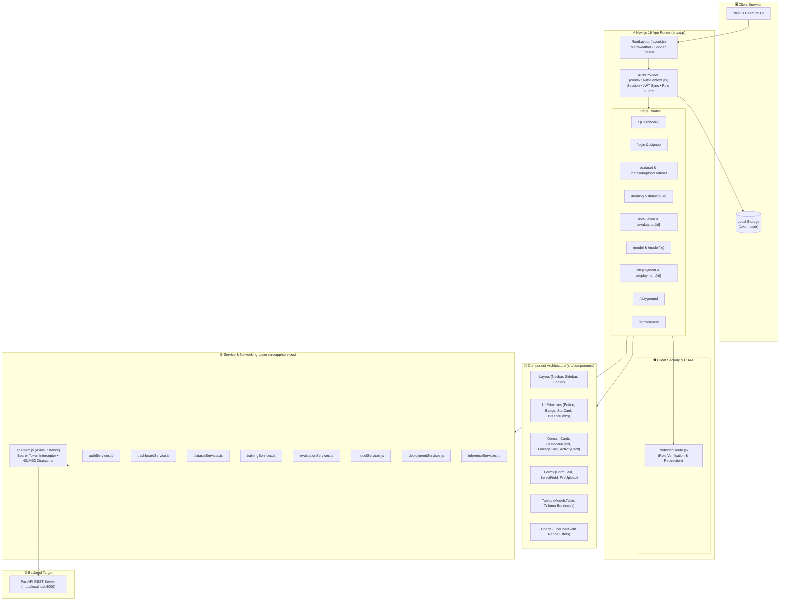
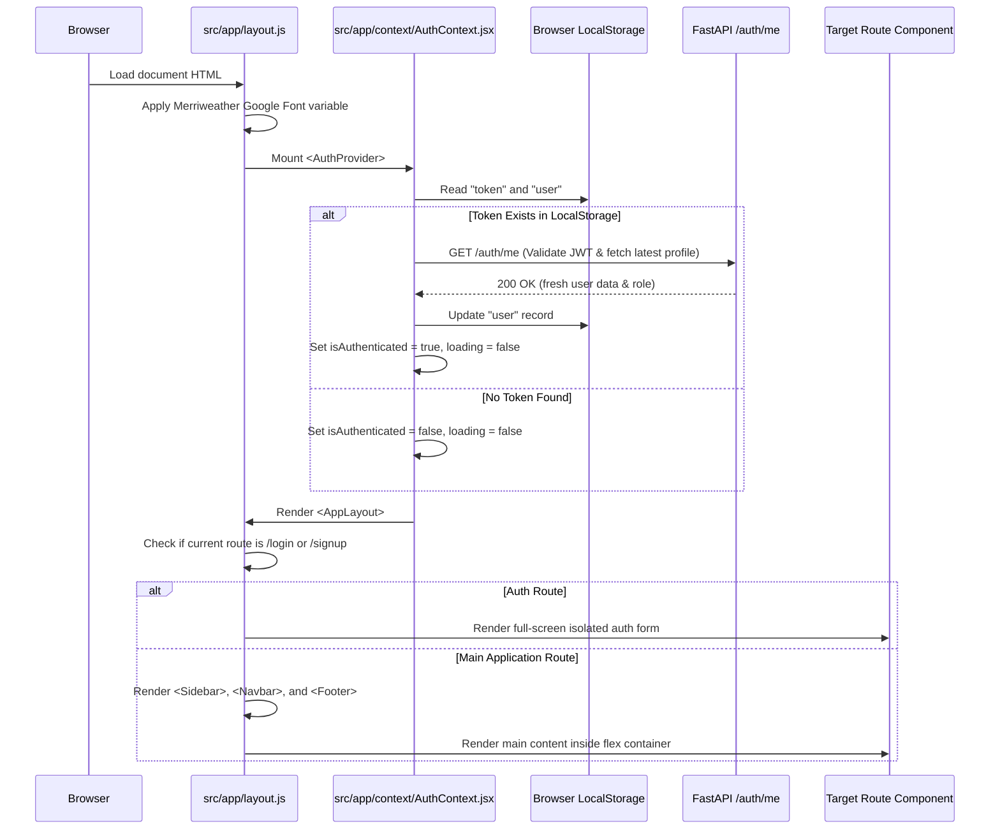
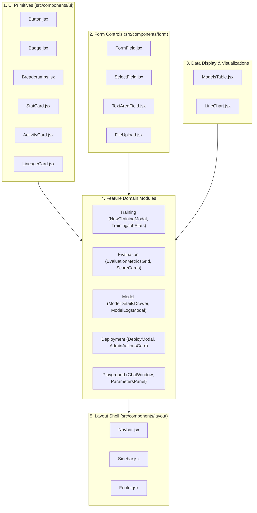
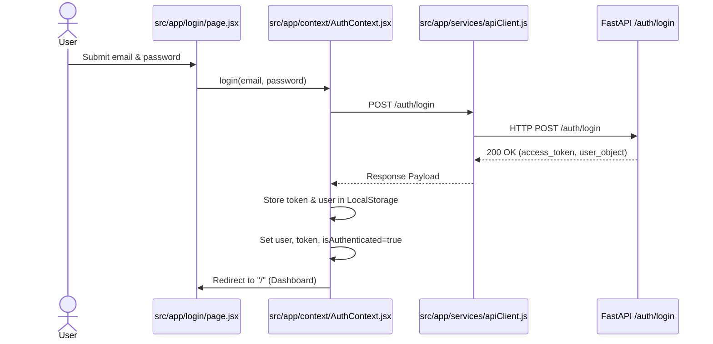
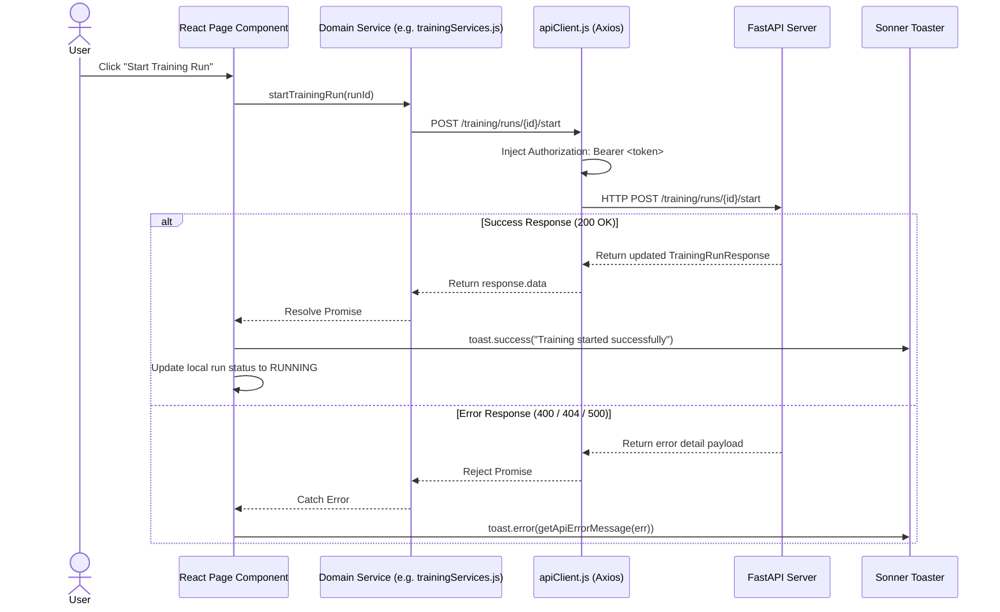

# HDFC Bank Custom LLM Development Pipeline — Frontend Architecture

> **Comprehensive Technical Architecture & System Design Document**  
> **Application:** **HDFC Bank** Enterprise LLM Development Frontend  
> **Framework:** Next.js 16.3.0 (App Router) / React 19.2.8 / JavaScript (ES2024)  
> **Styling System:** Tailwind CSS v4 / Merriweather Typography  
> **State & Networking:** React Context + Hooks / Axios HTTP Client / Sonner Notifications  

---

## 📌 Table of Contents

1. [Overview](#1-overview)
2. [Technology Stack](#2-technology-stack)
3. [High-Level Architecture Diagram](#3-high-level-architecture-diagram)
4. [Directory Structure](#4-directory-structure)
5. [Application Bootstrap Architecture](#5-application-bootstrap-architecture)
6. [Routing Architecture](#6-routing-architecture)
7. [Layout Architecture](#7-layout-architecture)
8. [Component Architecture & Hierarchy](#8-component-architecture--hierarchy)
9. [Authentication Architecture](#9-authentication-architecture)
10. [Authorization & RBAC Architecture](#10-authorization--rbac-architecture)
11. [State Management Architecture](#11-state-management-architecture)
12. [API Integration Architecture](#12-api-integration-architecture)
13. [Feature Module Architecture](#13-feature-module-architecture)
14. [Form Architecture](#14-form-architecture)
15. [Chart & Visualization Architecture](#15-chart--visualization-architecture)
16. [Error Handling Architecture](#16-error-handling-architecture)
17. [Responsive Architecture](#17-responsive-architecture)
18. [Environment Configuration](#18-environment-configuration)
19. [Build & Deployment Architecture](#19-build--deployment-architecture)
20. [Frontend Request Flow](#20-frontend-request-flow)
21. [Architecture Strengths](#21-architecture-strengths)
22. [Production Gaps & Recommendations](#22-production-gaps--recommendations)

---

# 1. Overview

The **HDFC Bank Custom LLM Development Pipeline** frontend is an enterprise web portal providing interactive interfaces for managing the full lifecycle of banking-grade Large Language Models:

* **Executive Dashboard:** Live aggregate KPIs, recent pipeline activity timeline, active deployment table, and historical training loss visualization.
* **Dataset Management:** Ingestion of multi-format banking datasets (`.csv`, `.xlsx`, `.json`, `.jsonl`), PII scanning & de-identification trigger, data quality metrics inspection, and automated Hugging Face dataset download/syncing.
* **Model Training Orchestration:** Interactive SFT/LoRA training run creation, base model selection (`Qwen2.5-1.5B`, `Qwen3-0.6B`, `SmolLM2-1.7B`), hyperparameter tuning, background worker execution, real-time step loss/progress streaming, and run cancellation.
* **Automated Evaluation Benchmarking:** Multi-metric benchmark scoring against test datasets (intent validity, grounded Q&A accuracy, citation verification, policy escalation, safety guardrails, and latency metrics).
* **Model Registry & 360° Detail View:** Version catalog, Quality Gate approvals, LoRA artifact metadata, and detailed model cards.
* **Deployment & Inference Serving:** Target environment deployment (`development`, `staging`, `production`), lifecycle rollback/restart, and an interactive **AI Playground** chat sandbox.
* **User & RBAC Administration:** Multi-tenant user management, role reassignment (`ADMIN`, `DS`, `REVIEWER`, `VIEWER`), and account activation toggling.

---

# 2. Technology Stack

| Category | Technology | Version | Purpose in Codebase |
| :--- | :--- | :--- | :--- |
| **Framework** | Next.js (App Router) | `16.3.0` | Client-side and server-rendered page routing, layout nesting, asset optimization |
| **UI Library** | React / React DOM | `19.2.8` | Component lifecycle, declarative JSX rendering, hooks |
| **Styling Engine** | Tailwind CSS | `^4.0.0` | Utility-first responsive CSS styling with `@import "tailwindcss"` and `@theme` |
| **Font Provider** | Next.js Font (`Merriweather`) | `16.3.0` | Google Serif typography optimized via CSS variable `--font-merriweather` |
| **HTTP Client** | Axios | `^1.19.0` | Centralized API client with JWT bearer interceptors and multipart support |
| **Form Handling** | React Hook Form / Zod | `^7.85.0` / `^4.4.3` | Schema-based form validation and dynamic input management |
| **Data Visualization**| Recharts | `^3.10.1` | Responsive SVG charts (Loss tracking, evaluation radar/bar metrics) |
| **Icons** | Lucide React | `^1.30.0` | Vector UI icons for navigation, status badges, and action triggers |
| **Toast Notifications**| Sonner | `^2.0.8` | Non-blocking global notification toasts for API alerts and error states |
| **Global State** | React Context API | `19.2.8` | Stateless session management (`AuthContext`), current user, and token persistence |

---

# 3. High-Level Architecture Diagram



---

# 4. Directory Structure

```text
frontend/
├── public/                             # Static public assets (images, logos, favicon)
│   └── images/                         # Bank logos & branding icons
├── src/
│   ├── app/                            # Next.js 16 App Router hierarchy
│   │   ├── admin/                      # Admin user management views
│   │   │   └── users/page.jsx          # User role and status administration
│   │   ├── context/                    # React Context providers
│   │   │   └── AuthContext.jsx         # Global authentication, JWT & RBAC state
│   │   ├── dataset/                    # Dataset domain routes
│   │   │   ├── [id]/page.jsx           # Dataset detail, versioning & PII scan
│   │   │   ├── uploadDataset/page.jsx  # Multipart file ingestion form
│   │   │   └── page.jsx                # Dataset catalog overview
│   │   ├── deployment/                 # Deployment domain routes
│   │   │   ├── [id]/page.jsx           # Deployment detail & runtime logs
│   │   │   └── page.jsx                # Serving deployments table
│   │   ├── evaluation/                 # Evaluation domain routes
│   │   │   ├── [id]/page.jsx           # Benchmark evaluation results & radar charts
│   │   │   └── page.jsx                # Evaluation history overview
│   │   ├── login/page.jsx              # User authentication login view
│   │   ├── model/                      # Model Registry routes
│   │   │   ├── [id]/page.jsx           # 360° Model detail view & lineage
│   │   │   └── page.jsx                # Model Registry catalog table
│   │   ├── playground/page.jsx         # Interactive model inference chat sandbox
│   │   ├── services/                   # Axios API service modules
│   │   │   ├── apiClient.js            # Base Axios instance with auth interceptors
│   │   │   ├── authService/            # Authentication & user API calls
│   │   │   ├── dashboardService/       # Live KPI & stats API calls
│   │   │   ├── datasetService/         # Dataset & PII processing API calls
│   │   │   ├── deploymentService/      # Deployment lifecycle API calls
│   │   │   ├── evaluationService/      # Evaluation execution API calls
│   │   │   ├── inferenceService/       # Inference execution API calls
│   │   │   ├── modelService/           # Model Registry API calls
│   │   │   └── trainingService/        # Training runs & step logs API calls
│   │   ├── signup/page.jsx             # New user registration view
│   │   ├── training/                   # Model Training routes
│   │   │   ├── [id]/page.jsx           # Live step-level loss training dashboard
│   │   │   └── page.jsx                # Training runs history table
│   │   ├── globals.css                 # Tailwind CSS v4 imports & theme fonts
│   │   ├── layout.js                   # Application root shell (Navbar, Sidebar, Footer)
│   │   └── page.jsx                    # Central pipeline dashboard (KPIs, Charts, Feeds)
│   └── components/                     # Modular component library
│       ├── auth/                       # Auth & RBAC guard components (ProtectedRoute.jsx)
│       ├── charts/                     # Recharts components (LineChart.jsx)
│       ├── deployment/                 # Deployment modal & cards
│       ├── evaluation/                 # Benchmark result cards & evaluation modal
│       ├── form/                       # Form controls (FormField, SelectField, FileUpload)
│       ├── layout/                     # Shell components (Navbar, Sidebar, Footer)
│       ├── metaGrid/                   # Generic metadata layout grids
│       ├── model/                      # Model drawers, logs modal, and card views
│       ├── playground/                 # Chat window, message bubbles, and hyperparameter sliders
│       ├── qualityMetrics/             # Data quality & PII metrics card
│       ├── tables/                     # Generic data table (ModelsTable) and column schemas
│       ├── training/                   # New training modal and stat widgets
│       └── ui/                         # Core UI primitives (Button, Badge, StatCard, Breadcrumbs)
├── package.json                        # Runtime dependencies & npm scripts
├── postcss.config.mjs                  # Tailwind CSS PostCSS configuration
├── jsconfig.json                       # Absolute module aliasing (`@/*` -> `./src/*`)
└── next.config.js                      # Next.js compiler & asset config
```

---

# 5. Application Bootstrap Architecture

The frontend initializes through a strict client-server provider wrapping flow:



---

# 6. Routing Architecture

The application uses **Next.js 16 App Router**. Every directory under `src/app` represents a distinct URL path segment.

### Complete Route Map:

| Route Path | Page Component | Access Guard | Functional Scope |
| :--- | :--- | :--- | :--- |
| **`/`** | `src/app/page.jsx` | Protected (`Authenticated`) | Live pipeline dashboard, KPI summary, training loss chart, and deployments |
| **`/login`** | `src/app/login/page.jsx` | Public (Anonymous only) | User authentication, email/password validation, token acquisition |
| **`/signup`** | `src/app/signup/page.jsx` | Public (Anonymous only) | New user registration, role selection (`DS`, `REVIEWER`, `VIEWER`) |
| **`/dataset`** | `src/app/dataset/page.jsx` | Protected (`Authenticated`) | Dataset catalog table, file size, format, and safe-for-training status |
| **`/dataset/uploadDataset`** | `src/app/dataset/uploadDataset/page.jsx` | Protected (`ADMIN`, `DS`) | Multipart file ingestion form (`.csv`, `.xlsx`, `.json`, `.jsonl`) |
| **`/dataset/[id]`** | `src/app/dataset/[id]/page.jsx` | Protected (`Authenticated`) | Dataset versioning, PII sanitization trigger, quality score metrics |
| **`/training`** | `src/app/training/page.jsx` | Protected (`Authenticated`) | Active & completed training runs, status filtering, new run modal |
| **`/training/[id]`** | `src/app/training/[id]/page.jsx` | Protected (`Authenticated`) | Live step-level loss progress, learning rate schedule, training cancellation |
| **`/evaluation`** | `src/app/evaluation/page.jsx` | Protected (`Authenticated`) | Evaluation run history, aggregate accuracy cards, new benchmark modal |
| **`/evaluation/[id]`** | `src/app/evaluation/[id]/page.jsx` | Protected (`Authenticated`) | Detailed evaluation report, radar breakdowns, safety violation checks |
| **`/model`** | `src/app/model/page.jsx` | Protected (`Authenticated`) | Model Registry catalog table, status filter (`READY`, `ACTIVE`, `ARCHIVED`) |
| **`/model/[id]`** | `src/app/model/[id]/page.jsx` | Protected (`Authenticated`) | 360° Model detail view, deployment target, LoRA commit hash, audit logs |
| **`/deployment`** | `src/app/deployment/page.jsx` | Protected (`Authenticated`) | Active serving endpoints, deployment modal, rollback & reload actions |
| **`/deployment/[id]`** | `src/app/deployment/[id]/page.jsx`| Protected (`Authenticated`) | Deployment health metrics, environment variables, latency tracking |
| **`/playground`** | `src/app/playground/page.jsx` | Protected (`Authenticated`) | Interactive multi-turn chat sandbox targeting deployed model endpoints |
| **`/admin/users`** | `src/app/admin/users/page.jsx`| Protected (`ADMIN` only) | User management, role elevation/demotion, account activation toggle |

---

# 7. Layout Architecture

The application layout is structured dynamically inside `src/app/layout.js`:

```text
┌────────────────────────────────────────────────────────────────────────┐
│                        RootLayout (globals.css)                        │
│ ┌────────────────────────────────────────────────────────────────────┐ │
│ │                         AuthProvider                               │ │
│ │ ┌────────────────────────────────────────────────────────────────┐ │ │
│ │ │                      AppLayout Shell                           │ │ │
│ │ │                                                                │ │ │
│ │ │  ┌──────────────┐ ┌──────────────────────────────────────────┐ │ │ │
│ │ │  │   Sidebar    │ │  Navbar (Fixed Header: Search, Role, User│ │ │ │
│ │ │  │  (W: 280px)  │ ├──────────────────────────────────────────┤ │ │ │
│ │ │  │              │ │                                          │ │ │ │
│ │ │  │  • Dashboard │ │                                          │ │ │ │
│ │ │  │  • Dataset   │ │            Page Content                  │ │ │ │
│ │ │  │  • Training  │ │         ({children} mounted here)        │ │ │ │
│ │ │  │  • Evaluation│ │                                          │ │ │ │
│ │ │  │  • Model     │ │                                          │ │ │ │
│ │ │  │  • Deployment│ ├──────────────────────────────────────────┤ │ │ │
│ │ │  │  • Playground│ │  Footer (Fixed margin-left: 280px)       │ │ │ │
│ │ │  │  • Admin     │ │                                          │ │ │ │
│ │ │  └──────────────┘ └──────────────────────────────────────────┘ │ │ │
│ │ └────────────────────────────────────────────────────────────────┘ │ │
│ │ <Toaster position="top-right" richColors closeButton />            │ │
│ └────────────────────────────────────────────────────────────────────┘ │
└────────────────────────────────────────────────────────────────────────┘
```

* **Sidebar (`src/components/layout/Sidebar.jsx`):** Fixed left navigation rail (280px width on `lg` viewports, off-canvas drawer on mobile) displaying brand badges, role indicators, and categorized navigation links.
* **Navbar (`src/components/layout/Navbar.jsx`):** Top bar with global search, role badges, notifications trigger, and user profile drawer.
* **Toaster (`sonner`):** High-priority notification portal fixed to the `top-right` displaying success, warning, and permission alerts.

---

# 8. Component Architecture & Hierarchy

Components are categorized into strict architectural tiers:



---

# 9. Authentication Architecture

Authentication is fully managed on the client side by `AuthContext.jsx` and synchronized with the backend via `apiClient.js`:



### Auto-Token Invalidation Flow:
If any API request returns `401 Unauthorized`:
1. `apiClient.js` response interceptor intercepts the error.
2. Clears `localStorage.removeItem("token")` and `localStorage.removeItem("user")`.
3. Dispatches global window event `auth:unauthorized`.
4. `AuthContext` catches the event, resets state, and immediately routes the browser to `/login`.

---

# 10. Authorization & RBAC Architecture

The frontend enforces **Role-Based Access Control** at multiple architectural boundaries:

| User Role | Navigation Menu Visibility | Page Access Permissions | Action Permissions |
| :--- | :--- | :--- | :--- |
| **`ADMIN`** | All Menus + `User Management` | Full access to all 16 routes | Full unrestricted control, role modification, account toggles |
| **`DS`** *(Data Scientist)* | Dashboard, Dataset, Training, Evaluation, Model, Deployment, Playground | All MLOps routes | Upload datasets, run PII cleaning, start/stop training, deploy models |
| **`REVIEWER`** | Dashboard, Dataset, Training, Evaluation, Model, Deployment, Playground | All MLOps routes | View runs, trigger evaluation benchmarks, update model statuses |
| **`VIEWER`** | Dashboard, Dataset, Training, Evaluation, Model, Deployment, Playground | Read-only access to all routes + Playground | Query playground, monitor runs, view logs. Modification blocked. |

### Enforcement Mechanisms:
1. **Navigation Rail Filter:** `Sidebar.jsx` hides the `User Management` link if `role !== "ADMIN"`.
2. **Page Component Guard:** `ProtectedRoute.jsx` wraps privileged pages (e.g. `/admin/users` requires `allowedRoles={["ADMIN"]}`) and renders a stylized **Access Restricted** card with role diagnostics if access is denied.
3. **API Interceptor Guard:** `apiClient.js` catches `403 Forbidden` responses and displays an immediate Sonner notification toast.

---

# 11. State Management Architecture

State is cleanly separated across four dedicated tiers:

```text
┌────────────────────────────────────────────────────────────────────────┐
│                        1. Global Auth State                            │
│           (AuthContext: user, token, role, isAuthenticated)            │
└───────────────────────────────────┬────────────────────────────────────┘
                                    │
                                    ▼
┌────────────────────────────────────────────────────────────────────────┐
│                        2. Server / Network State                       │
│    (Fetched via Services, Cached in Component useState, Polled)       │
└───────────────────────────────────┬────────────────────────────────────┘
                                    │
                                    ▼
┌────────────────────────────────────────────────────────────────────────┐
│                        3. Local Component State                        │
│          (Modals open/close, active tabs, filters, pagination)         │
└───────────────────────────────────┬────────────────────────────────────┘
                                    │
                                    ▼
┌────────────────────────────────────────────────────────────────────────┐
│                        4. Persistent Client Storage                    │
│            (LocalStorage: JWT token, serialized user profile)          │
└────────────────────────────────────────────────────────────────────────┘
```

---

# 12. API Integration Architecture

All networking logic is organized under `src/app/services/` with domain-specific wrappers communicating through the centralized `apiClient.js`:

```text
Page Component (e.g. src/app/training/page.jsx)
      │
      ▼
Domain Service Module (e.g. trainingServices.js -> getTrainingRuns())
      │
      ▼
Central API Client (apiClient.js)
      │  • Injects Bearer <token> from localStorage
      │  • Strips Content-Type for FormData uploads
      ▼
Backend FastAPI Endpoint (http://localhost:8000/training/runs)
      │
      ▼
Response Interceptor (Handles 401 Unauthorized / 403 Forbidden)
      │
      ▼
Domain Service Resolves Data to Component State
```

---

# 13. Feature Module Architecture

### 1. Dataset Management (`src/app/dataset`)
* **List View (`/dataset`):** Tabular overview of datasets, formats (`.csv`, `.xlsx`, `.json`), row counts, and safety status.
* **Upload View (`/dataset/uploadDataset`):** Multipart form upload supporting drag-and-drop file upload with category tagging.
* **Detail View (`/dataset/[id]`):** Displays version lineage, data quality scores, and initiates PII de-identification jobs.

### 2. Training Orchestration (`src/app/training`)
* **List View (`/training`):** Real-time list of training runs with status filters (`CREATED`, `RUNNING`, `COMPLETED`, `FAILED`, `STOPPED`).
* **Creation Modal (`NewTrainingModal.jsx`):** Allows selecting validated datasets, choosing supported base models (`Qwen3-0.6B`, etc.), setting epochs, batch size, and learning rate.
* **Live Step Telemetry (`/training/[id]`):** Polls backend training metrics every 3 seconds to display real-time loss curves, progress bars, and step progression.

### 3. Benchmark Evaluation (`src/app/evaluation`)
* **List View (`/evaluation`):** Evaluation historical runs with overall accuracy and safety compliance scores.
* **Detail View (`/evaluation/[id]`):** Granular breakdown across intent classification accuracy, structured SFT fidelity, citation correctness, and dangerous click safety violations.

### 4. Model Registry (`src/app/model`)
* **Catalog View (`/model`):** Displays fine-tuned models, base architectures, parameter sizes, and Quality Gate approval statuses.
* **360° Detail Drawer (`ModelDetailsDrawer.jsx`):** Inspects Hugging Face commit hashes, training datasets, deployment targets, and training loss sparklines.

### 5. Deployment & Serving (`src/app/deployment`)
* **Deployment Table (`/deployment`):** Active endpoints, target environments (`production`, `staging`), and operational controls (Undeploy, Restart, Rollback).

### 6. AI Playground Sandbox (`src/app/playground`)
* **Multi-Turn Chat (`PlaygroundChatWindow.jsx`):** Interactive prompt generation against active models.
* **Hyperparameter Controls (`PlaygroundParametersPanel.jsx`):** Sliders for `temperature`, `top_p`, `max_tokens`, and system role persona selection.

---

# 14. Form Architecture

Forms are implemented using a hybrid approach:
* **Controlled Inputs (`src/components/form/`):** `FormField`, `SelectField`, `TextAreaField`, and `FileUpload` provide unified styling, error borders, and focus rings.
* **Schema Validation:** Key forms use `react-hook-form` paired with `zod` for client-side type checking and required field assertions before submitting to backend services.

---

# 15. Chart & Visualization Architecture

Data visualizations are implemented using **Recharts (`^3.10.1`)**:
* **`LineChart.jsx` (`src/components/charts/LineChart.jsx`):** Responsive multi-line chart supporting live step loss curves, learning rate progression, interactive SVG tooltips, and time range filtering (`today`, `yesterday`, `last7`, `last10`).
* **Responsive Dimensions:** Wrapped in `<ResponsiveContainer width="100%" height={height}>` ensuring adaptation across desktop and mobile screens.

---

# 16. Error Handling Architecture

1. **API Error Parsing (`getApiErrorMessage` in `apiClient.js`):** Intelligently extracts error strings from FastAPI validation arrays (`detail: [{loc, msg}]`), plain strings, or fallback messages.
2. **Visual Toast Feedback:** Invokes `toast.error("Operation Failed", { description: msg })` for instant user feedback.
3. **Empty States:** `ModelsTable.jsx` and domain cards render explicit empty state vectors when no records are available.
4. **Retry Handlers:** Tables and widgets expose `onRetry` action buttons when network failures occur.

---

# 17. Responsive Architecture

The application is built mobile-first using standard Tailwind responsive utility classes:

| Breakpoint Prefix | Min Width | Layout Adaptation Behavior |
| :--- | :--- | :--- |
| **`sm`** | `640px` | 2-column stat card grids and expanded modal dialogs |
| **`md`** | `768px` | Global search bar appears in Navbar; horizontal form layouts |
| **`lg`** | `1024px` | Fixed 280px Sidebar appears; main container adjusts with `lg:ml-[280px]` |
| **`xl`** | `1280px` | 4-column metric grids and expanded dual-pane Playground layout |

---

# 18. Environment Configuration

The frontend is configured via `.env.local` or `.env.production`:

| Variable Name | Default Value | Purpose |
| :--- | :--- | :--- |
| `NEXT_PUBLIC_API_URL` | `http://127.0.0.1:8000` | Target FastAPI backend base URL for all HTTP requests |

---

# 19. Build & Deployment Architecture

* **Build Engine:** Next.js Compiler (`next build`).
* **Asset Output:** Static chunks and optimized assets generated to `.next/`.
* **Deployment Target:** Compatible with Node.js container runtimes, Vercel, or AWS Amplify.

---

# 20. Frontend Request Flow



---

# 21. Architecture Strengths

1. **Strict Token Interception:** Automatically injects JWT Bearer tokens and gracefully handles session expirations with automatic logout triggers.
2. **Unified UI & Design System:** Custom components adhere to the HDFC Bank color palette (`#002B55`, `#07477F`, `#D90000`) and typography.
3. **Dynamic Real-Time Telemetry:** Live polling and sparkline charts provide step-by-step visibility into MLOps training jobs.
4. **Resilient Form & File Handling:** Automatically detects `FormData` payloads and removes default JSON headers to let the browser compute proper multipart boundaries.

---

# 22. Production Gaps & Recommendations

### 🔴 Critical (High Priority)
* **Server-Side Route Protection (Next.js Middleware):**  
  * *Current State:* Route protection is executed entirely client-side inside `AuthContext.jsx` and `ProtectedRoute.jsx`.  
  * *Risk:* Unauthenticated users briefly see protected page layouts before being redirected.  
  * *Recommendation:* Implement a root `src/middleware.js` that inspects auth cookies and redirects before rendering HTML.
* **Secure Cookie Storage for JWT Tokens:**  
  * *Current State:* JWT tokens are stored in browser `localStorage`.  
  * *Risk:* Vulnerable to Cross-Site Scripting (XSS) extraction.  
  * *Recommendation:* Store JWT tokens in `httpOnly`, `Secure`, `SameSite=Strict` cookies.

### 🟠 Important (Medium Priority)
* **Server State Caching (TanStack React Query / SWR):**  
  * *Current State:* Component-level `useEffect` handles data fetching and manual polling.  
  * *Risk:* Redundant network requests, manual polling management, and lack of cache invalidation.  
  * *Recommendation:* Adopt TanStack React Query (`@tanstack/react-query`) for automated caching and polling.

### 🟡 Recommended (Low Priority)
* **Centralized Modal State Management:** Migrate feature modals to a unified dialog manager to prevent prop drilling.
* **Component Test Suite:** Introduce Jest and React Testing Library for core UI primitives and auth guards.
