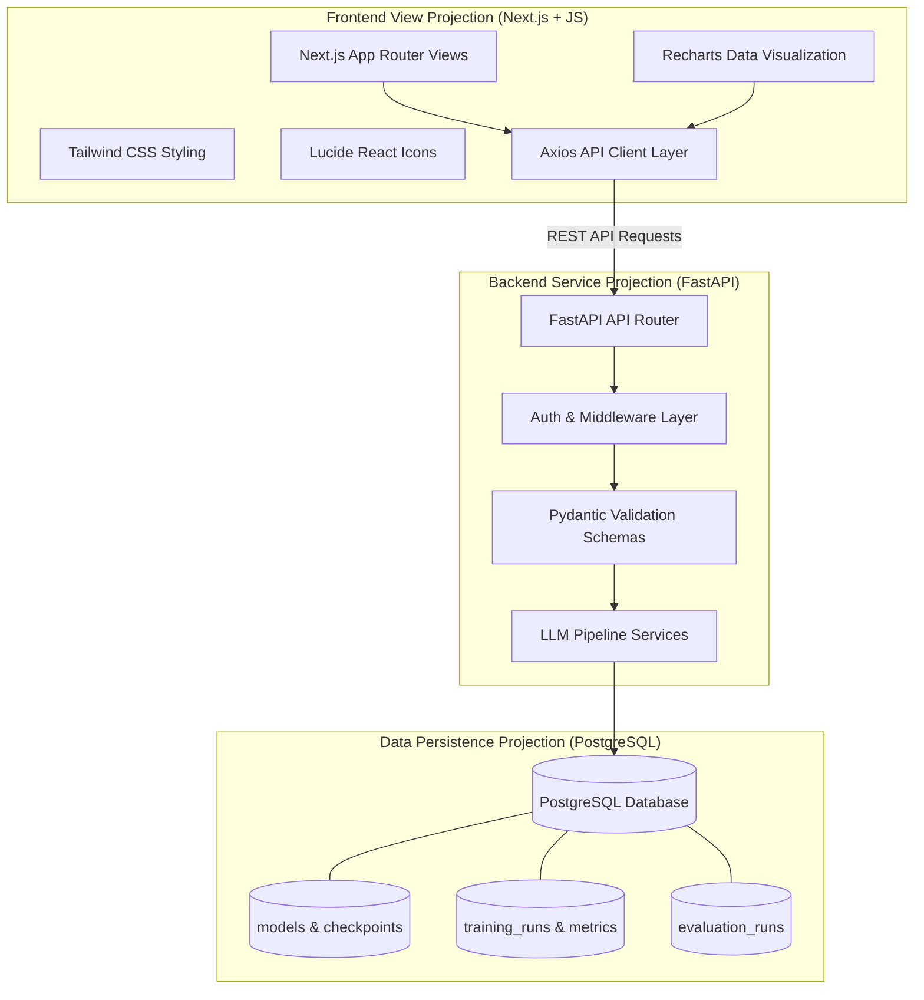

# HDFC Custom LLM Development Pipeline: Project Requirements Specification
**Document Type:** Projectional Requirements Specification Document  
**Version:** 1.0.0  
**Project:** HDFC Custom LLM Development Pipeline (`hdfc-custom-llm-dev-pipeline`)  
**Status:** Approved for Implementation  

---

## 1. Executive Summary & Document Scope

The **HDFC Custom LLM Development Pipeline** is an enterprise-grade platform designed for managing, fine-tuning, evaluating, deploying, and monitoring proprietary Large Language Models (LLMs). 

This document defines the system requirements using a **Projectional Requirements Architecture**. A projectional specification decomposes system requirements into distinct multi-dimensional views (projections)—mapping core business capabilities directly across the technology stack layers: **Frontend**, **Backend**, **Data Layer**, **User Interface**, and **API Interfaces**.

---

## 2. Technology Stack & Platform Architecture

### 2.1 Core Stack Breakdown

```
+---------------------------------------------------------------------------------------+
|                                    FRONTEND LAYER                                     |
|  [ Next.js (App Router) ]  [ JavaScript (ES6+) ]  [ Tailwind CSS ]  [ Lucide        React ]    |
|                        [ Axios ]                  [ Recharts ]                        |
+---------------------------------------------------------------------------------------+
                                           | HTTP / REST / WebSockets
                                           v
+---------------------------------------------------------------------------------------+
|                                    BACKEND LAYER                                      |
|            [ FastAPI Framework ]    [ Pydantic Schemas ]    [ Async Drivers ]         |
+---------------------------------------------------------------------------------------+
                                           | Async Engine / SQL Connection
                                           v
+---------------------------------------------------------------------------------------+
|                                     DATA LAYER                                        |
|                         [ PostgreSQL Relational Database ]                            |
+---------------------------------------------------------------------------------------+
```

| Domain | Technology | Core Responsibilities & Use Cases |
| :--- | :--- | :--- |
| **Frontend Framework** | **Next.js** | Server-Side Rendering (SSR), App Router layout, static site generation for documentation, dynamic routing for pipelines, optimal bundle chunking. |
| **Language** | **JavaScript (ES6+)** | Dynamic UI interactions, async/await pipeline handlers, state logic, stream processing for LLM tokens. |
| **Styling & UI Design** | **Tailwind CSS** | Custom design system, enterprise dark/light theme, glassmorphism card designs, responsive layout grids. |
| **Data Fetching** | **Axios** | Standardized HTTP requests, API request/response interceptors, auth token injection, error handling, SSE response streaming. |
| **Data Visualization** | **Recharts** | Real-time graphs for LLM training loss, validation accuracy, token throughput, GPU memory usage, radar charts for model evaluations. |
| **Iconography** | **Lucide React** | Consistent visual language for status indicators, pipeline controls, model status badges, and interactive controls. |
| **Backend API** | **FastAPI** | High-performance asynchronous RESTful APIs, automatic OpenAPI/Swagger spec generation, background task orchestration. |
| **Data Validation** | **Pydantic** | Strict type enforcement, payload serialization/deserialization, environment configuration management, runtime error handling. |
| **Database** | **PostgreSQL** | Relational storage for user accounts, datasets, model registry metadata, training logs, evaluation benchmarks, audit records. |

---

## 3. High-Level System Architecture Projection



---

## 4. Multi-Dimensional Projectional Specifications

In a projectional requirements format, each functional module is projected across **5 core dimensions**:
1. **Frontend View Projection** (Next.js Page & Components)
2. **UI & Visualization Projection** (Tailwind CSS, Recharts, Lucide React)
3. **API Client & Request Projection** (Axios Protocol)
4. **Backend Validation & Logic Projection** (FastAPI & Pydantic)
5. **Database Storage Projection** (PostgreSQL Schemas)

---

### Projection 1: Real-Time Model Training & Monitoring

#### Description
Provides real-time visibility into active fine-tuning jobs for custom LLMs, displaying loss curves, epoch progress, GPU metrics, and hyperparameter logs.

#### 1. Frontend View Projection
- **Route:** `/training/[id]`
- **Next.js Strategy:** Server Component shell with Client Component wrappers for real-time chart polling (`useClient`).
- **Core Components:** `TrainingDashboardShell`, `LossCurveChart`, `EpochProgressBar`, `MetricsSummaryCards`, `HyperparameterPanel`.

#### 2. UI & Visualization Projection
- **Icons (`Lucide React`):** `Play`, `Pause`, `Square`, `Activity`, `CheckCircle2`, `AlertTriangle`, `Cpu`, `Clock`.
- **Styling (`Tailwind CSS`):** Dark slate theme (`bg-slate-900`), status glowing accents (`shadow-emerald-500/20`), responsive grid layout (`grid grid-cols-12 gap-6`).
- **Analytics (`Recharts`):**
  - `ResponsiveContainer` + `LineChart` for **Training vs. Validation Loss** over steps.
  - `AreaChart` for **Learning Rate Decay**.
  - Custom tooltips formatted with dark background and colored legend dots.

#### 3. API Client & Request Projection (`Axios`)
- **API Call:** `Axios.get('/api/v1/training/runs/{run_id}/metrics')`
- **Polling / Stream:** Interceptor-backed long polling or SSE (Server-Sent Events) adapter.
- **Error Handling:** Retries on HTTP 503/504 with exponential backoff using custom Axios response interceptor.

#### 4. Backend Validation & Logic Projection (`FastAPI` & `Pydantic`)
- **FastAPI Endpoint:** `GET /api/v1/training/runs/{run_id}/metrics`
- **HTTP Method:** `GET`
- **Pydantic Response Schema:**
```python
class TrainingMetricItem(BaseModel):
    step: int
    epoch: float
    training_loss: float
    validation_loss: Optional[float] = None
    learning_rate: float
    gpu_memory_usage_gb: float
    timestamp: datetime

class TrainingRunStatusResponse(BaseModel):
    run_id: str
    model_name: str
    status: Literal["QUEUED", "RUNNING", "COMPLETED", "FAILED", "STOPPED"]
    current_step: int
    total_steps: int
    metrics_history: List[TrainingMetricItem]
```

#### 5. Database Storage Projection (`PostgreSQL`)
- **Tables Involved:** `training_runs`, `training_metrics`
- **Schema Mapping:**
```sql
CREATE TABLE training_runs (
    id UUID PRIMARY KEY DEFAULT gen_random_uuid(),
    model_id UUID NOT NULL REFERENCES models(id),
    status VARCHAR(50) NOT NULL DEFAULT 'QUEUED',
    hyperparameters JSONB NOT NULL,
    created_at TIMESTAMP WITH TIME ZONE DEFAULT CURRENT_TIMESTAMP,
    updated_at TIMESTAMP WITH TIME ZONE DEFAULT CURRENT_TIMESTAMP
);

CREATE TABLE training_metrics (
    id BIGSERIAL PRIMARY KEY,
    run_id UUID NOT NULL REFERENCES training_runs(id) ON DELETE CASCADE,
    step INT NOT NULL,
    epoch NUMERIC(6, 3) NOT NULL,
    training_loss NUMERIC(8, 6) NOT NULL,
    validation_loss NUMERIC(8, 6),
    learning_rate NUMERIC(10, 8) NOT NULL,
    gpu_memory_gb NUMERIC(5, 2),
    created_at TIMESTAMP WITH TIME ZONE DEFAULT CURRENT_TIMESTAMP
);
CREATE INDEX idx_training_metrics_run_step ON training_metrics(run_id, step);
```

---

### Projection 2: Model Evaluation & Benchmark Comparison

#### Description
Enables developers to benchmark multiple model versions against standard evaluation datasets (e.g., MMLU, GSM8K, custom enterprise QA benchmarks) across key metrics.

#### 1. Frontend View Projection
- **Route:** `/evaluation`
- **Next.js Strategy:** Dynamic route `/evaluation/compare?models=id1,id2`.
- **Core Components:** `EvalComparisonMatrix`, `RadarMetricsOverview`, `BenchmarkTable`, `ModelSelectorDropdown`.

#### 2. UI & Visualization Projection
- **Icons (`Lucide React`):** `BarChart3`, `Target`, `Zap`, `ShieldCheck`, `GitCompare`, `Download`, `Layers`.
- **Styling (`Tailwind CSS`):** Comparison tables with sticky headers (`sticky top-0 bg-slate-800`), badge colors for highest performance metrics (`bg-emerald-500/10 text-emerald-400`).
- **Analytics (`Recharts`):**
  - `RadarChart` + `Radar` + `PolarGrid` mapping metrics: Accuracy, Perplexity, Latency, hallucination score, and Safety score.
  - `BarChart` comparing Token Throughput (tokens/sec).

#### 3. API Client & Request Projection (`Axios`)
- **API Call:** `Axios.post('/api/v1/evaluations/compare', { model_ids: [...] })`
- **Payload Handling:** JSON body containing target `model_ids` and target `benchmark_ids`.

#### 4. Backend Validation & Logic Projection (`FastAPI` & `Pydantic`)
- **FastAPI Endpoint:** `POST /api/v1/evaluations/compare`
- **Pydantic Schemas:**
```python
class EvaluationCompareRequest(BaseModel):
    model_ids: List[str] = Field(..., min_items=1, max_items=5)
    benchmark_id: str

class BenchmarkMetricResult(BaseModel):
    metric_name: str  # e.g., BLEU, ROUGE-L, Latency_P95, Hallucination_Rate
    score: float
    unit: str

class ModelEvalSummary(BaseModel):
    model_id: str
    model_name: str
    overall_score: float
    metrics: List[BenchmarkMetricResult]

class EvaluationCompareResponse(BaseModel):
    benchmark_id: str
    benchmark_name: str
    timestamp: datetime
    comparisons: List[ModelEvalSummary]
```

#### 5. Database Storage Projection (`PostgreSQL`)
- **Tables Involved:** `evaluation_runs`, `evaluation_results`
- **Schema Mapping:**
```sql
CREATE TABLE evaluation_runs (
    id UUID PRIMARY KEY DEFAULT gen_random_uuid(),
    benchmark_name VARCHAR(100) NOT NULL,
    created_at TIMESTAMP WITH TIME ZONE DEFAULT CURRENT_TIMESTAMP
);

CREATE TABLE evaluation_results (
    id UUID PRIMARY KEY DEFAULT gen_random_uuid(),
    evaluation_run_id UUID NOT NULL REFERENCES evaluation_runs(id) ON DELETE CASCADE,
    model_id UUID NOT NULL REFERENCES models(id),
    metric_name VARCHAR(100) NOT NULL,
    score NUMERIC(8, 4) NOT NULL,
    created_at TIMESTAMP WITH TIME ZONE DEFAULT CURRENT_TIMESTAMP
);
```

---

### Projection 3: Interactive LLM Prompt & Inference Playground

#### Description
An interactive testing playground for evaluating model responses, tuning prompt system messages, context window sizes, temperature, and top_p parameters.

#### 1. Frontend View Projection
- **Route:** `/playground`
- **Next.js Strategy:** Client-heavy stateful interface using React hooks (`useState`, `useCallback`, `useRef`).
- **Core Components:** `SystemPromptEditor`, `ChatHistoryList`, `HyperparameterSidebar`, `TokenCounterBadge`.

#### 2. UI & Visualization Projection
- **Icons (`Lucide React`):** `Send`, `Sparkles`, `SlidersHorizontal`, `Copy`, `RotateCcw`, `MessageSquare`, `Bot`, `User`.
- **Styling (`Tailwind CSS`):** Split pane layout (`flex flex-row h-screen`), chat message bubbles (`bg-indigo-600` for user, `bg-slate-800` for LLM), custom scrollbars.
- **Analytics (`Recharts`):** Token generation speed gauge or latency breakdown bar inside response inspector.

#### 3. API Client & Request Projection (`Axios`)
- **API Call:** `Axios.post('/api/v1/inference/generate', payload, { responseType: 'stream' })`
- **Streaming:** Chunked processing for real-time token rendering.

#### 4. Backend Validation & Logic Projection (`FastAPI` & `Pydantic`)
- **FastAPI Endpoint:** `POST /api/v1/inference/generate`
- **Pydantic Schemas:**
```python
class InferenceRequestPayload(BaseModel):
    model_id: str
    system_prompt: Optional[str] = "You are a helpful HDFC Enterprise Assistant."
    user_prompt: str = Field(..., min_length=1)
    temperature: float = Field(default=0.7, ge=0.0, le=2.0)
    top_p: float = Field(default=0.9, ge=0.0, le=1.0)
    max_tokens: int = Field(default=512, ge=1, le=4096)

class InferenceResponsePayload(BaseModel):
    response_id: str
    model_id: str
    output_text: str
    prompt_tokens: int
    completion_tokens: int
    total_tokens: int
    latency_ms: float
```

#### 5. Database Storage Projection (`PostgreSQL`)
- **Tables Involved:** `prompt_histories`
- **Schema Mapping:**
```sql
CREATE TABLE prompt_histories (
    id UUID PRIMARY KEY DEFAULT gen_random_uuid(),
    model_id UUID NOT NULL REFERENCES models(id),
    system_prompt TEXT,
    user_prompt TEXT NOT NULL,
    generated_response TEXT NOT NULL,
    temperature NUMERIC(3,2),
    prompt_tokens INT NOT NULL,
    completion_tokens INT NOT NULL,
    latency_ms NUMERIC(8,2) NOT NULL,
    created_at TIMESTAMP WITH TIME ZONE DEFAULT CURRENT_TIMESTAMP
);
```

---

### Projection 4: Model Registry & Artifact Management

#### Description
Central catalog for registered LLM weights, base checkpoints (e.g., Llama-3, Mistral, custom HDFC fine-tunes), deployment states, and metadata.

#### 1. Frontend View Projection
- **Route:** `/models`
- **Next.js Strategy:** Server Component with static initial data and dynamic search filtering.
- **Core Components:** `ModelGridCard`, `ModelFilterBar`, `DeploymentStatusBadge`, `ArtifactDownloadModal`.

#### 2. UI & Visualization Projection
- **Icons (`Lucide React`):** `Box`, `Database`, `Tag`, `UploadCloud`, `CheckCircle`, `Server`, `HardDrive`, `ExternalLink`.
- **Styling (`Tailwind CSS`):** Card grid with hover transform (`hover:-translate-y-1 transition-all duration-200`), border gradients, status pill badges.

#### 3. API Client & Request Projection (`Axios`)
- **API Call:** `Axios.get('/api/v1/models', { params: { status: 'ACTIVE' } })`

#### 4. Backend Validation & Logic Projection (`FastAPI` & `Pydantic`)
- **FastAPI Endpoint:** `GET /api/v1/models`
- **Pydantic Schemas:**
```python
class ModelItemResponse(BaseModel):
    id: str
    name: str
    version: str
    base_model: str
    parameter_count: str  # e.g., "7B", "70B"
    framework: str        # PyTorch, ONNX, vLLM
    file_size_gb: float
    status: Literal["READY", "TRAINING", "DEPLOYED", "ARCHIVED"]
    created_at: datetime
```

#### 5. Database Storage Projection (`PostgreSQL`)
- **Tables Involved:** `models`
- **Schema Mapping:**
```sql
CREATE TABLE models (
    id UUID PRIMARY KEY DEFAULT gen_random_uuid(),
    name VARCHAR(255) NOT NULL,
    version VARCHAR(50) NOT NULL,
    base_model VARCHAR(255) NOT NULL,
    parameter_count VARCHAR(50) NOT NULL,
    framework VARCHAR(50) NOT NULL,
    storage_path TEXT NOT NULL,
    file_size_gb NUMERIC(6,2) NOT NULL,
    status VARCHAR(50) NOT NULL DEFAULT 'READY',
    created_at TIMESTAMP WITH TIME ZONE DEFAULT CURRENT_TIMESTAMP,
    CONSTRAINT uq_model_version UNIQUE (name, version)
);
```

---

## 5. Non-Functional Projectional Requirements

### 5.1 Performance & Latency SLA
- **Frontend (Next.js):** First Contentful Paint (FCP) `< 1.2s`, Time to Interactive (TTI) `< 2.0s`.
- **Data Visualizations (Recharts):** Smooth 60 FPS rendering for datasets up to 10,000 metric data points via data downsampling algorithms.
- **Backend API (FastAPI):** Non-streaming endpoint response time P95 `< 80ms`.
- **Database (PostgreSQL):** Metric log insertion handling up to 1,000 writes/second with indexed query performance `< 15ms`.

### 5.2 Security & Compliance Projection
- **Frontend Protection:** Content Security Policy (CSP), HTTP-only Secure Cookies for JWT storage, XSS protection.
- **API Security:** FastAPI OAuth2 + JWT Bearer token authentication middleware, strict CORS policy configuration.
- **Data Security:** PostgreSQL connection enforced over SSL/TLS (TLS v1.3), data-at-rest encryption via AES-256 for model metadata and prompts.

### 5.3 Reliability & Resilience
- **Axios Resiliency:** Request timeouts configured at 15s (standard) and 300s (long-running LLM tasks). Automatic retry logic for HTTP 502/503/504 errors.
- **PostgreSQL Connection Pool:** Async SQLAlchemy engine connection pooling (Pool Size: 20, Max Overflow: 10, Recycles idle connections after 1800s).

---

## 6. Directory Structure & File Projection

```
hdfc-custom-llm-dev-pipeline/
├── frontend/                        # Next.js Frontend Application
│   ├── src/
│   │   ├── app/                     # Next.js App Router Pages
│   │   │   ├── dashboard/page.js
│   │   │   ├── models/page.js
│   │   │   ├── training/[id]/page.js
│   │   │   ├── evaluation/page.js
│   │   │   └── playground/page.js
│   │   ├── components/              # React Components
│   │   │   ├── charts/              # Recharts wrappers (Loss, Radar, Gauges)
│   │   │   ├── ui/                  # Tailwind + Lucide UI widgets
│   │   │   └── playground/          # Interactive prompt components
│   │   ├── lib/
│   │   │   └── api.js               # Axios instance & interceptors setup
│   │   └── styles/
│   │       └── globals.css          # Tailwind directives & CSS variable tokens
│   ├── package.json                 # Front-end dependencies (next, react, recharts, lucide-react, axios, tailwindcss)
│   └── tailwind.config.js           # Custom theme colors and extension
│
├── backend/                         # FastAPI Backend Service
│   ├── app/
│   │   ├── main.py                  # FastAPI instantiation & CORS initialization
│   │   ├── api/                     # Router endpoints
│   │   │   ├── v1/
│   │   │   │   ├── models.py
│   │   │   │   ├── training.py
│   │   │   │   ├── evaluation.py
│   │   │   │   └── inference.py
│   │   ├── schemas/                 # Pydantic data validation models
│   │   │   ├── model_schema.py
│   │   │   ├── training_schema.py
│   │   │   └── evaluation_schema.py
│   │   ├── db/                      # PostgreSQL connection pool & session
│   │   │   ├── session.py
│   │   │   └── models.py            # ORM metadata definitions
│   │   └── services/                # Business logic & pipeline drivers
├── docs/                            # Requirements and Architecture Specs
│   └── requirements/
│       └── project_requirements.md  # [THIS DOCUMENT]
└── README.md
```

---

## 7. Verification & Sign-off Criteria

1. **Frontend Integrity:** All Next.js pages render cleanly with JavaScript, formatted with Tailwind CSS, utilizing Lucide React icons, fetching via Axios, and displaying accurate Recharts graphs.
2. **Backend API Compliance:** FastAPI endpoints strictly validate inputs and outputs against Pydantic models.
3. **Database Consistency:** PostgreSQL tables properly enforce primary keys, foreign key constraints, and indices for query performance.
4. **End-to-End Flow:** Verified pipeline execution from UI user trigger to backend FastAPI controller, persisted in PostgreSQL, and streamed back to the client.
